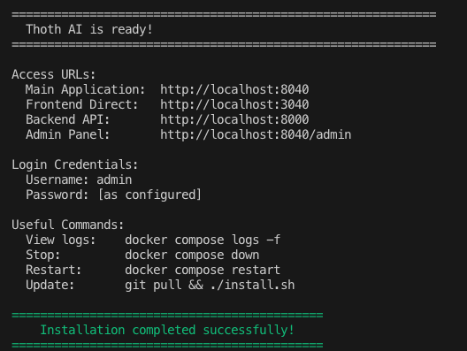
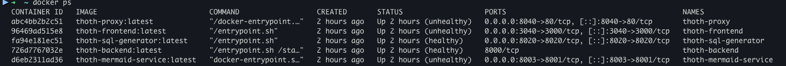

# Installazione su Docker con install.sh

**ThothAI** fornisce uno script di installazione unificato `install.sh` (`install.ps1` su Windows usando PowwerShell) che semplifica notevolmente il processo di installazione e configurazione del sistema completo.

!!! success "Installazione Automatizzata"
    
    Lo script `install.sh` (o `install.ps1`) rappresenta il metodo più semplice e veloce per installare ThothAI, gestendo automaticamente la configurazione, la generazione dei file di ambiente e l'avvio dei servizi Docker.

    Anche se è possibile eseguire i comandi di installazione manualmente, lo script `install.sh` è la soluzione più rapida e affidabile per installare ThothAI.

## Prerequisiti

Prima di utilizzare lo script di installazione, assicurarsi di avere:

- **Python 3.13++** installato nel sistema
- **Docker** e **Docker Compose** installati e funzionanti

## 1. Prima Installazione

### 1.1 Preparazione della Configurazione

**Attività obbligatoria**: Creare e compilare il file `config.yml.local` prima di eseguire `install.sh`:

Vedere i dettagli [in questa pagina del capitolo di preparazione all'installazione](../1-docker_install/1.1-sources_cloning.md)
```bash
cp config.yml config.yml.local
```

**Conseguenze della mancata configurazione**:

- Lo script termina immediatamente con errore
- Richiede configurazione di API keys per i servizi AI
- Richiede configurazione del provider di embedding
- Richiede impostazione preferenze database e porte dei servizi

### 1.2 Esecuzione Base

```bash
./install.sh
```

**Cosa fa automaticamente**:

- Verifica tutti i prerequisiti di sistema
- Installa pacchetti Python necessari (pyyaml, requests, toml, ecc.)
- Valida la configurazione fornita
- Configura le dipendenze per il servizio di embedding
- Avvia l'installer interattivo per la selezione dei database
- Esegue il deploy automatico dei container Docker

La prima installazione richiederà diversi minuti in quanto si dovranno costruire 5 containers per i vari servizi. Le successive manutenzioni saranno più veloci.
Al termine dell'installazione comparirà il seguente messaggio:



Esaminando il contenuto di Docker, si vedranno attivi i seguenti container:


I container sono:

- `thoth-backend`: il container del backend di ThothAI, un'applicazione Django che gestisce la configurazione dell'applicazione e fornisce alcune funzionalità di insight dei database collegati a ThothAI
- `thoth-frontend`: il container del frontend di ThothAI, realizzato in NextJs, che gestisce l'interfaccia utente del frontend
- `thoth-sql-generator`: l'applicazione Python che fornisce le funzionalità di generazione di query SQL
- `thoth-proxy`: il container Nginx che fa da proxy al backend Django
- `thoth-mermaid-service`: il container che fornisce le funzionalità di conversione degli schemi ERD da notazione `mermaid` a SVG per una visualizzazione grafica degli stessi

Una volta completata l'installazione, si può passare ad utilizzare ThothAI. 

## 2. Opzioni di Configurazione Avanzate

### 2.1 Opzione di Pulizia Cache Build (`--clean-cache`)

```bash
./install.sh --clean-cache
```

In Windows (PowerShell)
```powershell
.\install.ps1 -CleanCache
```

**Quando usare**:

- Nel caso siano state apportate modifiche al Dockerfile
- Quando si verificano errori di build inconsistenti
- Per liberare spazio disco dalla cache Docker

**Conseguenze**:

- Aumenta il tempo di build alla successiva esecuzione
- Risolve problemi di cache corrotta
- Non influisce sui dati dell'applicazione

### 2.2 Opzione di Pulizia Completa Risorse (`-PruneAll`)


```bash
./install.sh --prune-all
```

In Windows (PowerShell)
```powershell
.\install.ps1 -PruneAll
```

**Quando usare**:

- Per fare un reset completo dell'ambiente Docker
- Prima di una reinstallazione da zero in cui si vuole essere sicuri di non avere residui di versioni precedenti
- Per liberare spazio disco significativo
- Quando si verificano conflitti tra versioni

**Conseguenze**:

- **DISTRUGGE TUTTI I DATI** nei volumi Docker
- Rimuove tutti i container, immagini, volumi e reti ThothAI
- Effettua una riconfigurazione completa
- È necessaria conferma esplicita (salvo che venga lanciata con `--force`, in Windows `-Force`)

#### Opzioni di sicurezza per `-PruneAll`:

**Modalità preview** (`-DryRun`):
```bash
./install.sh --prune-all --dry-run
```

In Windows (PowerShell)

```powershell
.\install.ps1 -PruneAll -DryRun
```

- Mostra cosa verrebbe eliminato senza rimuoverlo
- Utile per verificare l'impatto prima dell'operazione

**Esecuzione forzata** (`-Force`):
```bash
./install.sh --prune-all --force
```

In Windows
```powershell
.install.ps1 -PruneAll -Force
```

- Salta la richiesta di conferma
- Utile per script automatizzati

## 3. Manutenzione e Aggiornamenti

### 3.1 Aggiornamenti di Release

Quando si aggiorna ThothAI a una nuova versione:


```bash
git pull origin main

# Opzione 1: Aggiornamento standard (raccomandato)
./install.sh

# Opzione 2: Aggiornamento con pulizia cache (per evitare potenziali problemi di build)
./install.sh --clean-cache
```

**Processo automatico**:

- Rileva modifiche alla configurazione
- Rigenera file di ambiente se necessario
- Ricostruisce container con nuove versioni
- Preserva dati esistenti nei volumi

## 4. Sistema di Configurazione

### 4.1 File di Configurazione Richiesti

**config.yml.local** (obbligatorio):

- API keys per almeno un provider AI (OpenAI, Anthropic, OpenRouter, etc.)
- Configurazione provider di embedding
- Preferenze database SQL
- Porte dei servizi (se diverse dai default)
- Credenziali amministratore

**Conseguenze scelte database**:
- **PostgreSQL, MySQL, MariaDB, Informix, SQL Server**: Massima compatibilità, prestazioni ottimali
- **SQLite**: Semplice, adatto a piccoli deployment (sempre incluso)

## 5. Flusso Operativo Completo

### Prima Installazione:

**Linux/macOS**:

1. Creare `config.yml.local` con API keys
2. Eseguire `./install.sh`
3. Attendere completamento deploy
4. Autenticarsi come demo o come admin per accedere a una delle interfacce web
5. Selezionare un workspace (demo per utilizzare il database di esempio)
6. Verificare esecuzione delle funzionalità

**Windows (PowerShell)**:

1. Creare `config.yml.local` con API keys
2. Eseguire `.\install.ps1`
3. Attendere completamento deploy
4. Autenticarsi come demo o come admin per accedere a una delle interfacce web
5. Selezionare un workspace (demo per utilizzare il database di esempio)
6. Verificare esecuzione delle funzionalità

### Aggiornamenti Successivi:

1. Aggiornare codice sorgente tramite git pull
2. Modificare `config.yml.local` se necessario
3. Eseguire script appropriato per il sistema:
   - Linux/macOS: `./install.sh` (o con `--clean-cache`)
   - Windows PowerShell: `.\install.ps1` (o con `-CleanCache`)
4. Sistema rileva automaticamente le modifiche

### Reset Completo:

1. Backup dati importanti (se necessario)
2. Verificare impatto:
   - Linux/macOS: `./install.sh --prune-all --dry-run`
   - Windows PowerShell: `.\install.ps1 -PruneAll -DryRun`
3. Eseguire pulizia:
   - Linux/macOS: `./install.sh --prune-all` (con conferma)
   - Windows PowerShell: `.\install.ps1 -PruneAll` (con conferma)
4. Ricominciare da prima installazione

## 6. Gestione Errori e Troubleshooting

**Configurazione mancante**:

- Errore immediato con istruzioni per creare `config.yml.local`

**Prerequisiti mancanti**:

- Verifica automatica di Python 3.13+, Docker, Docker Compose
- Messaggi chiari con link per installazione

**Errori di validazione**:

- Analisi automatica della configurazione
- Messaggi specifici sugli errori da correggere

**Problemi di embedding**:

- Configurazione critica per il funzionamento
- Errore bloccante se non configurato correttamente

!!! tip "Raccomandazioni"
    
    - **Prima installazione**: Seguire il flusso standard senza opzioni aggiuntive
    - **Aggiornamenti**: Usare `./install.sh` semplice per preservare configurazione
    - **Problemi**: Provare prima `--clean-cache`, `-prune-all` solo se indispensabile
    - **Produzione**: Usare sempre `--dry_run` prima di operazioni distruttive

!!! warning "Attenzione alle operazioni distruttive"
    
    L'opzione `--prune-all` (`-PruneAll` in Windows) **distrugge irreversibilmente tutti i dati**. Utilizzare solo quando necessario e sempre con backup preventivo.