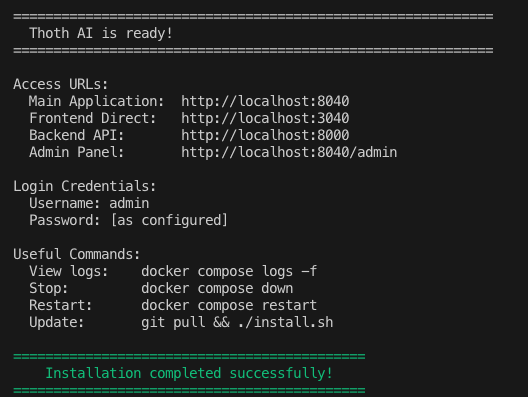
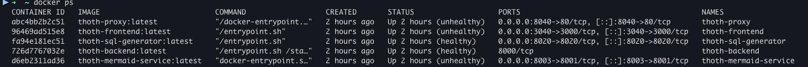

# Installation on Docker with install.sh.

**ThothAI** provides a unified installation script `install.sh` (`install.ps1` on Windows using PowerShell) that greatly simplifies the installation and configuration of the complete system.

!!! success "Automated Installation"
    
    The `install.sh` (or `install.ps1`) script is the easiest and fastest way to install ThothAI, automatically handling configuration, generation of environment files and startup of Docker services.

    Although it is possible to run the installation commands manually, the `install.sh` script is the quickest and most reliable solution for installing ThothAI.

## Prerequisites

Before using the installation script, make sure you have:

- **Python 3.13++** installed on the system
- **Docker** and **Docker Compose** installed and working

## 1. First Installation

### 1.1 Preparing the Configuration

**Mandatory step**: Create and fill in the `config.yml.local` file before running `install.sh`:

See the details [in this page of the installation preparation chapter](../1-docker_install/1.1-sources_cloning.md)
```bash
cp config.yml config.yml.local
```

**Consequences of missing configuration**:

- The script terminates immediately with an error
- Requires configuration of API keys for AI services
- Requires configuration of the embedding provider
- Requires setting database preferences and service ports

### 1.2 Basic Execution

```bash
./install.sh
```

**What it does automatically**:

- Verifies all system prerequisites
- Installs required Python packages (pyyaml, requests, toml, etc.)
- Validates the provided configuration
- Configures dependencies for the embedding service
- Starts the interactive installer for database selection
- Performs the automatic deploy of Docker containers

The first installation will take several minutes, as 5 containers must be built for the various services. Subsequent maintenance operations will be faster.
At the end of the installation, the following message will appear:



If you inspect Docker, you will see the following containers running:


The containers are:

- `thoth-backend`: the ThothAI backend container, a Django application that manages the application configuration and provides some insight functionality on databases connected to ThothAI
- `thoth-frontend`: the ThothAI frontend container, built with NextJs, which manages the frontend user interface
- `thoth-sql-generator`: the Python application that provides SQL query generation capabilities
- `thoth-proxy`: the Nginx container that proxies the Django backend
- `thoth-mermaid-service`: the container that converts ERD diagrams from `mermaid` notation to SVG for graphical visualization

Once the installation is complete, you can start using ThothAI.

## 2. Advanced Configuration Options

### 2.1 Build Cache Cleanup option (`--clean-cache`)

```bash
./install.sh --clean-cache
```

On Windows (PowerShell)
```powershell
./install.ps1 -CleanCache
```

**When to use it**:

- When changes have been made to the Dockerfile
- When inconsistent build errors occur
- To free disk space from the Docker cache

**Consequences**:

- Increases build time on the next run
- Solves corrupted cache issues
- Does not affect application data

### 2.2 Full Resources Cleanup option (`-PruneAll`)


```bash
./install.sh --prune-all
```

On Windows (PowerShell)
```powershell
./install.ps1 -PruneAll
```

**When to use it**:

- To perform a complete reset of the Docker environment
- Before a clean reinstallation when you want to ensure there are no leftovers from previous versions
- To free up significant disk space
- When version conflicts occur

**Consequences**:

- **DESTROYS ALL DATA** in Docker volumes
- Removes all ThothAI containers, images, volumes and networks
- Performs a complete reconfiguration
- Requires explicit confirmation (unless launched with `--force`, on Windows `-Force`)

#### Safety options for `-PruneAll`:

**Preview mode** (`-DryRun`):
```bash
./install.sh --prune-all --dry-run
```

On Windows (PowerShell)

```powershell
./install.ps1 -PruneAll -DryRun
```

- Shows what would be deleted without actually removing it
- Useful to verify the impact before running the operation

**Forced execution** (`-Force`):
```bash
./install.sh --prune-all --force
```

On Windows
```powershell
./install.ps1 -PruneAll -Force
```

- Skips the confirmation prompt
- Useful for automated scripts

## 3. Maintenance and Upgrades

### 3.1 Release upgrades

When upgrading ThothAI to a new version:


```bash
git pull origin main

# Option 1: Standard upgrade (recommended)
./install.sh

# Option 2: Upgrade with cache cleanup (to avoid potential build issues)
./install.sh --clean-cache
```

**Automatic process**:

- Detects configuration changes
- Regenerates environment files if needed
- Rebuilds containers with new versions
- Preserves existing data in volumes

## 4. Configuration System

### 4.1 Required Configuration Files

**config.yml.local** (mandatory):

- API keys for at least one AI provider (OpenAI, Anthropic, OpenRouter, etc.)
- Embedding provider configuration
- SQL database preferences
- Service ports (if different from defaults)
- Administrator credentials

**Database choice consequences**:
- **PostgreSQL, MySQL, MariaDB, Informix, SQL Server**: maximum compatibility, optimal performance
- **SQLite**: simple, suitable for small deployments (always included)

## 5. Complete Operational Flow

### First Installation:

**Linux/macOS**:

1. Create `config.yml.local` with API keys
2. Run `./install.sh`
3. Wait for the deploy to complete
4. Log in as demo or admin to access one of the web interfaces
5. Select a workspace (demo to use the sample database)
6. Verify that the features are working correctly

**Windows (PowerShell)**:

1. Create `config.yml.local` with API keys
2. Run `./install.ps1`
3. Wait for the deploy to complete
4. Log in as demo or admin to access one of the web interfaces
5. Select a workspace (demo to use the sample database)
6. Verify that the features are working correctly

### Subsequent Upgrades:

1. Update source code via git pull
2. Edit `config.yml.local` if needed
3. Run the appropriate script for your system:
   - Linux/macOS: `./install.sh` (or with `--clean-cache`)
   - Windows PowerShell: `./install.ps1` (or with `-CleanCache`)
4. The system automatically detects changes

### Full Reset:

1. Back up important data (if needed)
2. Check the impact:
   - Linux/macOS: `./install.sh --prune-all --dry-run`
   - Windows PowerShell: `./install.ps1 -PruneAll -DryRun`
3. Perform cleanup:
   - Linux/macOS: `./install.sh --prune-all` (with confirmation)
   - Windows PowerShell: `./install.ps1 -PruneAll` (with confirmation)
4. Start again from the first installation steps

## 6. Error Handling and Troubleshooting

**Missing configuration**:

- Immediate error with instructions to create `config.yml.local`

**Missing prerequisites**:

- Automatic check for Python 3.13+, Docker, Docker Compose
- Clear messages with links to installation instructions

**Validation errors**:

- Automatic configuration analysis
- Specific messages describing the issues to fix

**Embedding issues**:

- Critical configuration for correct operation
- Blocking error if not configured correctly

!!! tip "Recommendations"
    
    - **First installation**: Follow the standard flow without additional options
    - **Upgrades**: Use a simple `./install.sh` to preserve configuration
    - **Issues**: Try `--clean-cache` first; use `--prune-all` only if strictly necessary
    - **Production**: Always use `--dry-run` before running destructive operations

!!! warning "Beware of destructive operations"
    
    The `--prune-all` option (`-PruneAll` on Windows) **irreversibly destroys all data**. Use it only when necessary and always with a prior backup.