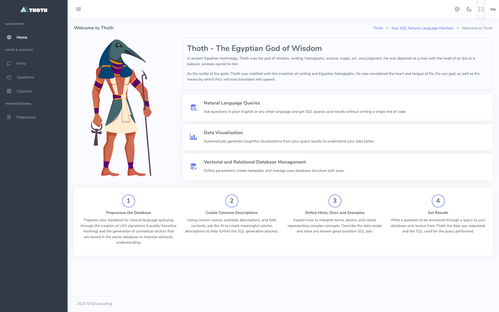

# Installazione sotto Docker
L'installazione più semplice è quella che può essere effettuata utilizzando Docker. 

!!! note "Installazione di Docker"

    L'installazione e la configurazione di Docker sono attività al di fuori dello scope di questo documento.
    Eventualmente seguire li istruzioni per [Installare Docker sul vostro sistema](https://docs.docker.com/engine/install/)

Dando per scontato che Docker sia installato e funzionante, queste sono le azioni da eseguire per installare Thoth sotto Docker

## 1 - Procedura di Setup di Thoth (backend)
Il setup di Thoth sotto Docker prevede:

### 1.1 - Impostazione del file _env
Per prima cosa è necessario creare e successivamente completare il file _env. Per farlo si deve:  

1. copiare il file _env.template in _env
2. aprire con un editor qualunque il file _env e riempire i placeholder delle API key degli LLM che intendete utilizzare
3. inserire la chiavi SECRET_KEY e DJANGO_API_KEY appena generate negli appositi placeholder
    
### 1.2 - Esecuzione del docker-compose up

```bash
docker-compose up --build -d
```

Una volta eseguito il docker-compose up verificare che i processi siano correttamente funzionanti con.

```bash
docker ps
```

Deve comparire una lista come la seguente:


## 1.3 - Setup del backend
### 1.3.1 - Creazione di un superuser
Il primo comando crea un utente superuser da utilizzare per accedere al backend.
```bash
python manage.py createsuperuser
```

Rispondere alle domande poste da Thoth (in quanto applicazione DJango) e creare un utente superuser.

###  1.3.2 - Setup iniziale
Procedere quindi a caricare un setup base completo e consistente da usare come setup minimo iniziale.
```bash
python manage.py import_groups
python manage.py import_users
python manage.py import_all_csv --docker
```

Con questi due comandi si creano cinque gruppi (Admin, Editor, BasicUser, TechUser e DebugUser) e due utenti (marco e maria).
Inoltre si crea un setup completo con delle configurazioni base funzionanti, associate agli utenti marco e maria, che possono essere usate come template per gli altri utenti.

### 1.3.3 Verifica del funzionamento dell'applicazione sotto Docker
A questo punto è possibile aprire **http://localhost:8040**, fare login con l'utente definito come superuser e ritrovarsi di fronte a questa form:


La componente di backend di Thoth è "up and running" su Docker e si può passare al completamento del suo setup, che viene documentato [nell'apposita pagina](../3-reference_manual/3.1-setup/3.1.0-setup_process.md)

# 2 - Installazione dell'applicazione di frontend, ThothSL
Una volta installato il backend, si può installare il frontend, dal nome ThothSL (SL sta per Streamlit che è il tool usato per gestire la user interface). Entrare quindi nel progetto ThothSL e procedere come segue

## 2.1 - Impostazione del file _env
Copiare _env.template in _env e compilare i placeholder necessari. 
Devono essere necessariamente inserite le key di Django DJANGO_API_KEY e di almeno un provider LLM. La KEY di Logfire è fortemente consigliata, ma non obbligatoria.

## 2.2 - Esecuzione del docker-compose up

```bash
docker-compose up --build -d
```

Compare una form di login all'indirizzo http://localhost:8501. Si può quindi effettuare il setup del frontend, come indicato [nell'apposita pagina](../3-reference_manual/3.1-setup/3.1.0-setup_process.md).
