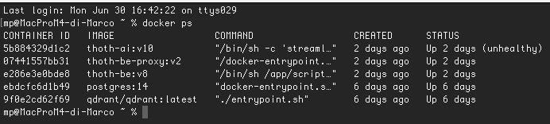
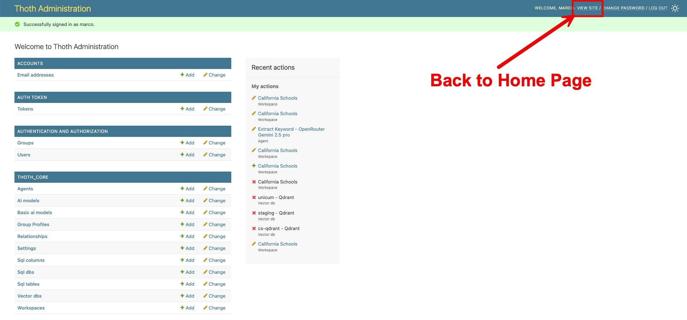

# Installazione sotto Docker
L'installazione più semplice è quella che può essere effettuata utilizzando Docker. 

!!! note "Installazione di Docker"

    L'installazione e la configurazione di Docker sono attività al di fuori dello scope di questo documento.
    Eventualmente seguire li istruzioni per [Installare Docker sul vostro sistema](https://docs.docker.com/engine/install/)

Dando per scontato che Docker sia installato e funzionante, queste sono le azioni da eseguire per installare ThothAI sotto Docker

### 1 - Procedura di installazione di Thoth (backend)

#### 1.1 - Impostazione del file _env
Per prima cosa è necessario creare e successivamente completare il file _env. Per farlo si deve:  

1. copiare il file `_env.template` in `_env`
2. aprire con un editor qualunque il file `_env`  e riempire i placeholder delle API key degli LLM che intendete utilizzare
3. inserire la chiavi SECRET_KEY e DJANGO_API_KEY appena generate negli appositi placeholder
    
#### 1.2 - Esecuzione del docker-compose up
Una volta disponibili i sorgenti eseguire il seguente comando:

```bash
docker-compose up --build -d
```
Una volta eseguito il docker-compose up verificare che i processi siano correttamente funzionanti con.

```bash
docker ps
```

Deve comparire una lista come la seguente:




La prima colonna a sinistra mostra gli id dei container presenti. Individuare l'id di `thoth-be e copiarlo in memoria

Accedere al container eseguendo il comando
```bash
docker exec -it thoth-be-id-just-copied /bin/bash
```

Ora si può procedere ad eseguire i comandi necessari per la configurazione minima di default

### 1.3 - Creazione di un superuser
Il primo comando crea un utente superuser da utilizzare per accedere al backend.
```bash
python manage.py createsuperuser
```

Rispondere alle domande poste da Thoth (in quanto applicazione Django) e creare un utente superuser, utilizzando uno username diverso da quello che avranno gli utenti reali.

###  1.4 - Setup iniziale
Procedere quindi a caricare un setup base completo e consistente da usare come setup minimo iniziale.
```bash
python manage.py load_defaults --source=docker
```

!!! note "Attenzione al parametro --source!"

    E' importante indicare --source=docker, in quanto alcuni parametri per il deploy sotto Docker sono diversi rispetto a quelli usati per il deploy in locale.
    
    Nel caso abbiate sbagliato tenete conto che la procedura di load_defaults può essere ripetuta, e che il parametro fondamentale da verificare è il VectorDb cs_sqlite che deve avere come host=thoth-qdrant e non localhost

Con il comando `load_defaults si creano cinque gruppi (Admin, Editor, BasicUser, TechUser e DebugUser) e due utenti (marco e maria).
Inoltre si crea un setup completo per modelli AI, agenti, database e workspace con delle configurazioni base funzionanti, associate agli utenti marco e maria, che possono essere usate come template per i futuri utenti reali.

## 2 - Installazione dell'applicazione di frontend, ThothSL
Una volta installato il backend, si può installare il frontend, dal nome **ThothSL** (SL sta per Streamlit che è il tool usato per gestire la user interface). Entrare quindi nel progetto **ThothSL** e procedere come segue:

### 2.1 - Impostazione del file _env
Copiare `_env.template` in `_env e compilare i placeholder necessari. 
Devono essere necessariamente inserite le key di Django DJANGO_API_KEY e di almeno un provider LLM. La KEY di Logfire è fortemente consigliata, ma non obbligatoria.

### 2.2 - Esecuzione del docker-compose up

```bash
docker-compose up --build -d
```

## 3 - Verifica del funzionamento dell'applicazione sotto Docker

### 3.1 - Verifica del backend
Per verificare il backend è possibile aprire [http://localhost:8040](http://localhost:8040) e fare login con l'utente superuser appena creato.

Ci si ritroverà di fronte a questa form:


Cliccando sull'icona in alto a destra, evidenziata col contorno in rosso, è possibile accedere all'area amministrativa:




Cliccando sul link "view site" si torna alla Home Page del backend

### 3.2 - Verifica del frontend
Per verificare il frontend è possibile andare al [http://localhost:8501](http://localhost:8501) e fare login sempre con credenziali `marco/thoth_pwd`. 

Ci si trova di fronte a questa form:


## 4 - Conclusione

Le due componenti di **ThothAI**, denominate **Thoth** e **ThothSL**, sono ora "up and running" su Docker e si può passare al completamento della loro configurazione.
Per un setup rapido, che fa uso dei default e dura pochi minuti, andare alla pagina dove viene descritto il [Quick Setup](1.4-quick_setup.md).

In seguito si potrà realizzare un setup completo, con nuovi utenti, nuovi gruppi, nuovi database, ecc. 
Per farlo partire dalla [pagina di setup dello Usere Manual](../3-user_manual/3.1-setup/3.1.0-setup_process.md)
