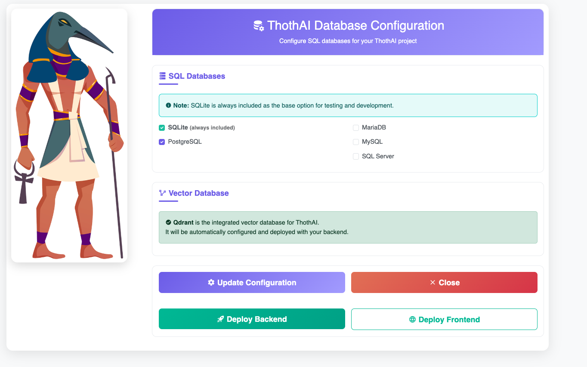

# Installazione Interattiva con install.sh

**ThothAI** fornisce uno script di installazione unificato `install.sh` (`install.bat` sotto Windows) che semplifica notevolmente il processo di installazione sia del backend (thoth) che del frontend (thothui).

!!! success "Installazione Automatizzata"
    
    Lo script `install.sh` (`install.bat` sotto Windows) rappresenta il metodo più semplice e veloce per installare ThothAI, gestendo automaticamente la creazione degli ambienti virtuali, l'installazione delle dipendenze e l'avvio dei servizi Docker.

## Prerequisiti

Prima di utilizzare lo script di installazione, assicurarsi di avere:

- **Python 3.13+** installato nel sistema
- **Docker** e **Docker Compose** (raccomandato per il deployment)
- **Git** per la clonazione dei repository
- Le **API Keys** necessarie (vedi [Acquisizione Sorgenti](1.1-sources_cloning.md#2-le-api-keys))

## 1. Preparazione dell'Ambiente

### 1.1 - Clonazione del Repository Unificato

Se non è già stato fatto, clonare i due repository:

```bash
git clone https://github.com/mptyl/Thoth.git 
git clone https://github.com/mptyl/ThothUI.git 
```
Al termine entrare nella directory `thoth` appena creata.


## 2 - Il comando install.sh (install.bat)

Il comando `./install.sh` è uno script di installazione interattivo per ThothAI che automatizza il setup 
completo dell'ambiente, gestisce le dipendenze e permette la configurazione personalizzata dei database attraverso un'interfaccia web.



### 2.1 - Cosa fa lo script

#### 2.1.1 - Verifica dell'ambiente

- Controlla di essere eseguito dalla directory corretta (deve contenere pyproject.toml)
- Se non trova il file, termina con un errore

#### 2.1.2 - Installazione di uv

- Verifica se uv (gestore pacchetti Python) è installato
- Se mancante, lo installa automaticamente:
    - macOS/Linux: usa curl per scaricare e installare
    - Windows (Git Bash/Cygwin): usa PowerShell
    - Aggiunge uv al PATH per la sessione corrente
    - Verifica che l'installazione sia riuscita

#### 2.1.3 - Installazione delle dipendenze Python

- Esegue `uv sync --extra dev` per installare tutti i pacchetti Python necessari
- Include le dipendenze di sviluppo
- Verifica il successo dell'operazione

#### 2.1.4 - Configurazione ambiente

- Controlla se esiste il file _env
- Se mancante, lo crea copiando _env.template
- Avvisa l'utente di modificare il file per aggiungere le API keys

#### 2.1.5 - Verifica Docker 

- Controlla che Docker sia installato
- Verifica che Docker Desktop sia in esecuzione
- Se Docker non è disponibile, termina con errore

#### 2.1.6 - Setup infrastruttura Docker 

- Crea la rete Docker thothnet se non esiste
- Crea il volume condiviso thoth-shared-data se non esiste
- Questi sono necessari per la comunicazione tra container

#### 2.1.7 - Avvio installer interattivo 

- Termina eventuali processi esistenti sulla porta 8199
- Avvia un server FastAPI (installer_main.py) in background
- Il server fornisce un'interfaccia web per la configurazione

#### 2.1.8 - Apertura browser

- Rileva il sistema operativo
- Apre automaticamente il browser all'indirizzo http://localhost:8199
- Supporta macOS (open), Linux (xdg-open), Windows (start)

#### 2.1.9 - Interfaccia utente

L'interfaccia web permette di:

- Selezionare i database SQL da supportare (SQLite sempre incluso)
- Deploy Backend: avvia i container Docker per thoth_be
- Deploy Frontend: avvia i container Docker per thoth_ui
- Shutdown: termina l'installer quando completato

## 3 - Come usare install.sh

### 3.1 - Prerequisiti

1. Sistema operativo: Linux, macOS o Windows (con Git Bash)
2. Docker Desktop installato e in esecuzione
3. Connessione internet per scaricare dipendenze

### 3.2 - Utilizzo base

####  3.2.1 - Dare permessi di esecuzione (solo la prima volta)
chmod +x install.sh

### 3.2.2 - Eseguire l'installer
./install.sh

## 4 - Processo di installazione
### 4.1 - Avvio script

Lo script verifica automaticamente tutti i prerequisiti
#### 4.1.2 - Configurazione database
- Si apre automaticamente il browser
- Selezionare i database desiderati:
    - PostgreSQL (consigliato)
    - MySQL
    - MariaDB
    - SQL Server
    - SQLite (sempre incluso)

#### 4.1.3 - Deploy componenti

- Cliccare "Deploy Backend" per avviare thoth_be
- Cliccare "Deploy Frontend" per avviare thoth_ui
- Attendere il completamento (indicatori di stato visibili)

#### 4.1.4 - Completamento
- Cliccare "Shutdown Installer"
- I servizi rimangono attivi

## 5 - Punti di accesso dopo l'installazione
- Backend API: http://localhost:8040
- Admin Panel: http://localhost:8040/admin
- Frontend UI: http://localhost:3001 (se deployato)
- Qdrant Dashboard: http://localhost:6333/dashboard

## 6 - Funzionalità dell'installer interattivo

L'installer interattivo offre:

### 6.1 - Selezione multipla database
- Supporta PostgreSQL, MySQL, MariaDB, SQL Server, SQLite
- Aggiorna automaticamente pyproject.toml con i driver necessari
- Gestisce le dipendenze di sistema per ogni database

### 6.2 - Gestione dipendenze intelligente
- Distingue tra database "sicuri" (PostgreSQL, SQLite) e quelli che richiedono librerie di sistema
- Fornisce istruzioni specifiche per l'installazione locale se necessario
- Docker funziona sempre, indipendentemente dalle dipendenze locali

### 6.3 - Deploy automatizzato
- Esegue `docker-compose up --build -d` per il backend
- Cerca e deploya automaticamente il frontend se presente
- Monitoraggio in tempo reale dello stato del deployment

## 7 - Gestione errori
Lo script gestisce automaticamente:

- uv non installato: lo installa automaticamente
- Docker non disponibile: termina con messaggio chiaro
- File _env mancante: lo crea dal template
- Porta 8199 occupata: termina il processo esistente
- Directory errata: avvisa l'utente della posizione corretta

## 8 - Note importanti

1. API Keys: Prima dell'installazione, modificare _env per aggiungere le chiavi API necessarie
2. Docker richiesto: L'applicazione gira in container Docker per garantire compatibilità
3. Database locali: Per sviluppo locale senza Docker, alcuni database potrebbero richiedere librerie di sistema aggiuntive
4. Persistenza: I dati sono salvati nel volume Docker thoth-shared-data

## 9 - Comandi post-installazione
### 9.1 - Fermare i servizi
docker-compose down

### 9.2 - Riavviare i servizi
docker-compose up -d

### 9.3 - Vedere i log
docker-compose logs -f

### 9.4 - Accedere al container backend
docker exec -it thoth-be bash


## 10 - Risoluzione problemi

- "pyproject.toml not found": Eseguire lo script dalla directory root di thoth_be
- "Docker is not running": Avviare Docker Desktop
- Porta 8199 occupata: Lo script termina automaticamente il processo precedente
- Browser non si apre: Navigare manualmente a http://localhost:8199

!!! tip "Suggerimento"
    
    Lo script `install.sh` può essere eseguito più volte senza problemi. Se si cambiano le configurazioni di database o si aggiungono nuove dipendenze, semplicemente rieseguire lo script per aggiornare l'installazione.

!!! warning "Attenzione"
    
    L'installazione modifica i file di configurazione esistenti. Se si hanno personalizzazioni importanti, effettuare un backup prima di procedere.