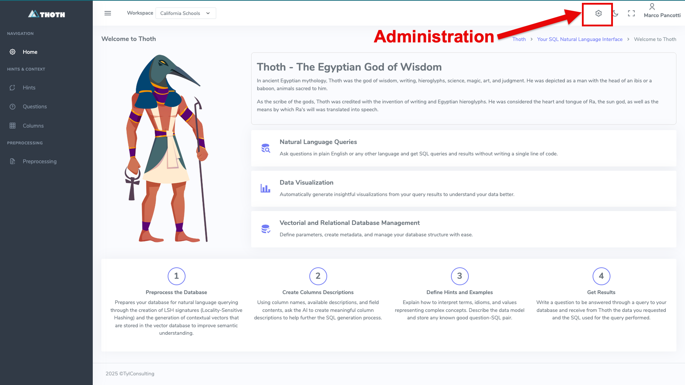
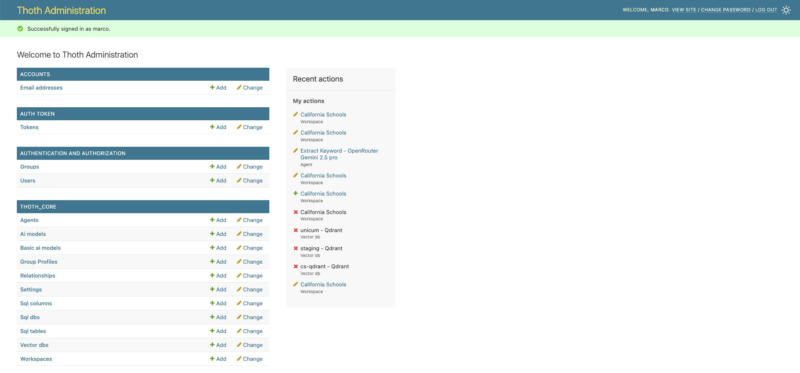
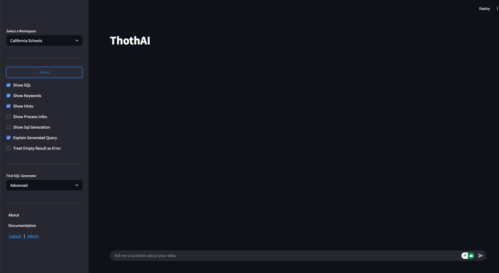

# Installazione di ThothAI in locale
L'installazione in locale comprende l'installazione del backend **Thoth** e del frontend **ThothSL**.

L'installazione in locale del backend **Thoth** è predisposta per essere in modalità `Development di Django.
Ciò è impostato nei parametri DEBUG=True e PROFILE='Dev' presenti nel file .env.template che deve essere copiato in .env e compilato come  previsto al punto 1.1.


!!! note "Il setup Django"

    Come si imposta un'applicazione Django è al di fuori dello scope di questa documentazione
    Andare alla [pagina ufficiale di Django](https://docs.djangoproject.com/en/5.2/howto/deployment/) su questo argomento per ulteriori dettagli.
    In questo progetto si assume che un utente interessato a gestire il backend in modalità Developer conosca Django abbastanza da esssere in grado di modificare Thoth senza difficoltà

## 1 - Procedura di Setup di Thoth (locale)

## 1.1 - Impostazione del file .env
Per prima cosa è necessario creare e successivamente completare il file .env. Per farlo si deve:

1. copiare il file `.env.template` in `.env`
2. aprire con un editor qualunque il file `_env e riempire i placeholder delle API key degli LLM che intendete utilizzare
3. inserire la chiavi SECRET_KEY e DJANGO_API_KEY appena generate negli appositi placeholder


## 1.2 - Creazione ambiente virtuale
a questo punto si deve impostare e attivare un ambiente virtuale Python con 
``` bash
python3 -m venv .venv
source .venv/bin/activate
```

## 1.3 - Installazione package necessari

### Installazione con uv (consigliato)
Il progetto utilizza `uv` per la gestione delle dipendenze:

```bash
# Installare uv se non presente
curl -LsSf https://astral.sh/uv/install.sh | sh

# Installazione base (PostgreSQL + SQLite)
uv sync

# Per aggiungere supporto MariaDB
uv sync --extra mariadb

# Per aggiungere supporto SQL Server  
uv sync --extra sqlserver

# Per aggiungere entrambi i database extra
uv sync --extra all-databases

# Per installare anche gli strumenti di sviluppo
uv sync --extra dev
```

### Installazione manuale con pip (alternativa)
Se non si vuole usare uv:
```bash
pip install -r requirements.txt

# Per database aggiuntivi, installare i driver necessari:
# MariaDB: pip install mariadb>=1.1.0
# SQL Server: pip install pyodbc>=4.0.0
```

## 1.4 - Migrazione database
Effettuare le migrazioni necessarie per aggiornare il database di Django
```bash
python manage.py migrate
```

## 1.5 - Creazione di un superuser
Creare un utente superuser da utilizzare per accedere al backend.
```bash
python manage.py createsuperuser
```

###  1.6 - Setup iniziale
Caricare un setup base completo e consistente da usare come setup minimo iniziale.
```bash
python manage.py load_defaults --source=local
```

!!! note "Attenzione al parametro --source!"

    E' importante indicare --source=local, in quanto alcuni parametri per il deploy sotto Docker sono diversi rispetto a quelli usati per il deploy in locale.
    
    Nel caso abbiate sbagliato tenete conto che la procedura di load_defaults può essere ripetuta, e che il parametro fondamentale da verificare è il VectorDb cs_sqlite che deve avere come host=localhost


## 1.7 - Run del server
Una volta completato il setup base si può lanciare il server Django digitando
```bash
python manage.py runserver
```

## 1.8 Verifica del funzionamento dell'applicazione di backend in locale
A questo punto è possibile aprire **http://localhost:8000**, fare login con l'utente definito come superuser e ritrovarsi di fronte a questa form:



Cliccando sull'icona in alto a destra, evidenziata col contorno in rosso, è possibile accedere all'area amministrativa:



Cliccando sul link "view site" si torna alla Home Page del backend

La componente **Thoth** di **ThothAI** è "up and running" in locale e si può passare al completamento del suo setup, che viene documentato nell'[apposita pagina](../3-user_manual/3.1-setup/3.1.0-setup_process.md).

# 2 - Installazione dell'applicazione di frontend, ThothSL
Una volta installato il backend, si può installare il frontend, dal nome **ThothSL** (SL sta per Streamlit che è il tool usato per gestire la user interface). 
Entrare quindi nel progetto ThothSL e procedere come segue.


### 2.1 - Impostazione del file .env
Copiare `.env.template` in `.env e compilare i placeholder necessari.
Devono essere necessariamente inserite le key di Django DJANGO_API_KEY e di almeno un provider LLM. La KEY di Logfire è fortemente consigliata, ma non obbligatoria.

## 2.2 - Creazione ambiente virtuale
Impostare un ambiente python con
``` bash
python3 -m venv .venv
source .venv/bin/activate
```
## 2.3 - Installazione package necessari
Installare tutti i package necessari
```bash
pip install -r requirements.txt
```

## 2.4 - Creazione di un link simbolico con la directory 'data' di Thoth
Collegare la directory 'data' del backend tramite un link simbolico. 
 Sotto windows:
```bash
mklink ../Thoth/data data
```

Sotto Linux o MacOs:
```bash
ln -s ../Thoth/data data
```

## 2.5 - Eseguire l'applicazione
Eseguire il comando
```bash
streamlit run ThothAI.py
```
Si è rediretti all'indirizzo [http://localhost:8503](http://localhost:8503) dove compare una form di login. Effettuare il login con utente `marco`e password `thoth_pwd

Ci si troverà di fronte a questa form:



Le due componenti di **ThothAI**, denominate **Thoth** e **ThothSL**, sono ora "up and running" in locale e si può passare al completamento della loro configurazione.
Per un setup rapido, che fa uso dei default e dura pochi minuti, andare alla pagina dove viene descritto il [Quick Setup](1.4-quick_setup.md).

In seguito si potrà realizzare un setup completo, con nuovi utenti, nuovi gruppi, nuovi database, ecc.
Per farlo partire dalla [pagina di setup dello Usere Manual](../3-user_manual/3.1-setup/3.1.0-setup_process.md)
