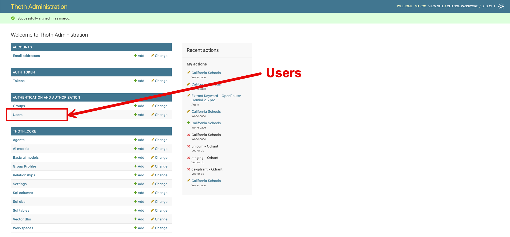

# Installazione di ThothAI in locale

L'installazione in locale comprende l'installazione del backend Django, del SQL Generator (FastAPI) e del frontend Next.js.

!!! info "Sviluppo Locale"
    Lo sviluppo locale utilizza `.env.local` nella directory root e lo script `start-all.sh` per avviare tutti i servizi


!!! note "Il setup Django"

    Come si imposta un'applicazione Django è al di fuori dello scope di questa documentazione
    Andare alla [pagina ufficiale di Django](https://docs.djangoproject.com/en/5.2/howto/deployment/) su questo argomento per ulteriori dettagli.
    In questo progetto si assume che un utente interessato a gestire il backend in modalità Developer conosca Django abbastanza da esssere in grado di modificare Thoth senza difficoltà

## 1 - Sistema di Configurazione per Sviluppo Locale

### 1.1 - File di Configurazione

#### .env.local
- **Ruolo**: Configurazione unificata per tutti i servizi locali
- **Creazione**: Copiare da `.env.template` e personalizzare
- **Contenuto**: API keys, porte locali, URL servizi, credenziali
- **Utilizzo**: Caricato automaticamente da `start-all.sh`

### 1.2 - Flusso di Configurazione Locale

```
.env.local → start-all.sh → export variabili → Servizi ereditano
           ↓                      ↓
    (filtro PORT=)        Django, SQL Gen, Frontend
```

**Processo:**
1. `start-all.sh` carica `.env.local` (escluso PORT generico)
2. Esporta variabili nell'ambiente shell
3. Ogni servizio eredita le variabili:
   - Django (porta 8200)
   - SQL Generator (porta 8180) 
   - Frontend (porta 3200)
   - Qdrant (porta 6334)

## 2 - Preparazione Ambiente

### 2.1 - Impostazione del file .env.local

1. Copiare il template:
```bash
cp .env.template .env.local
```

2. Modificare `.env.local` con le proprie configurazioni:
   - API keys degli LLM (almeno uno richiesto)
   - Embedding service configuration
   - Porte locali (se quelle di default sono occupate)
   - Credenziali admin


### 2.2 - Gestione Python con uv

Il progetto usa `uv` per gestire Python in modo consistente:

```bash
# Installare uv se non presente
curl -LsSf https://astral.sh/uv/install.sh | sh

# Installare Python gestito da uv (3.13.5)
uv python install 3.13.5

# Creare .python-version files
echo "3.13.5" > backend/.python-version
echo "3.13.5" > frontend/sql_generator/.python-version
```

### 2.3 - Installazione Dipendenze

#### Backend Django
```bash
cd backend
uv sync  # Crea .venv e installa dipendenze
cd ..
```

#### SQL Generator
```bash
cd frontend/sql_generator
uv sync  # Crea .venv e installa dipendenze
cd ../..
```

#### Frontend Next.js
```bash
cd frontend
npm install
cd ..
```

## 3 - Avvio Servizi con start-all.sh

### 3.1 - Utilizzo Base

```bash
# Dare permessi di esecuzione (solo prima volta)
chmod +x start-all.sh

# Avviare tutti i servizi
./start-all.sh
```

### 3.2 - Servizi Avviati

Lo script avvia automaticamente:
- **Django Backend**: http://localhost:8200
- **SQL Generator**: http://localhost:8180
- **Frontend**: http://localhost:3200
- **Qdrant** (Docker): http://localhost:6334

### 3.3 - Gestione Servizi

- **Stop tutti**: `Ctrl+C` nello script
- **Logs Django**: Visibili nel terminale
- **Logs SQL Gen**: Visibili nel terminale
- **Frontend Dev**: Hot reload automatico

## 4 - Configurazione Database e Migrazioni

### 4.1 - Migrazioni Django
Le migrazioni vengono eseguite automaticamente da `start-all.sh`, ma possono essere eseguite manualmente:

```bash
cd backend
export $(grep -v '^#' ../.env.local | grep -v '^PORT=' | xargs)
uv run python manage.py migrate
```

### 4.2 - Creazione Superuser
Per accedere al pannello di amministrazione Django:

```bash
cd backend
export $(grep -v '^#' ../.env.local | grep -v '^PORT=' | xargs)
uv run python manage.py createsuperuser
```

## 5 - Risoluzione Problemi

### 5.1 - Conflitti di Porta
Se le porte di default sono occupate, modificare in `.env.local`:
- `BACKEND_LOCAL_PORT=8200`
- `SQL_GENERATOR_LOCAL_PORT=8180`
- `FRONTEND_LOCAL_PORT=3200`

### 5.2 - Python Version
Se `uv` usa il Python di sistema invece di quello gestito:
1. Verificare `.python-version` files nelle directory
2. Reinstallare con: `uv python install 3.13.5`
3. Ricreare venv: `rm -rf .venv && uv sync`

### 5.3 - Variabili Ambiente
- **PORT generico**: Filtrato da `start-all.sh` per evitare conflitti
- **API Keys**: Devono essere configurate in `.env.local`
- **Database**: SQLite di default, PostgreSQL/MySQL richiedono configurazione

## 6 - Differenze Docker vs Locale

| Aspetto | Docker | Locale |
|---------|--------|--------|
| Config File | `config.yml.local` → `.env.docker` | `.env.local` |
| Script Avvio | `install.sh` | `start-all.sh` |
| Porte Backend | 8040 | 8200 |
| Porte SQL Gen | 8020 | 8180 |
| Porte Frontend | 3040 | 3200 |
| Python | Container isolato | uv-managed 3.13.5 |
| Database | Volume Docker | File locale |

###  1.6 - Setup iniziale
Caricare un setup base completo e consistente da usare come setup minimo iniziale.
```bash
python manage.py load_defaults --source=local
```

!!! note "Attenzione al parametro --source!"

    E' importante indicare --source=local, in quanto alcuni parametri per il deploy sotto Docker sono diversi rispetto a quelli usati per il deploy in locale.
    
    Nel caso abbiate sbagliato tenete conto che la procedura di load_defaults può essere ripetuta, e che il parametro fondamentale da verificare è il VectorDb cs_sqlite che deve avere come host=localhost


## 1.7 - Run del server
Una volta completato il setup base si può lanciare il server Django digitando
```bash
python manage.py runserver
```

## 1.8 Verifica del funzionamento dell'applicazione di backend in locale
A questo punto è possibile aprire **http://localhost:8000**, fare login con l'utente definito come superuser e ritrovarsi di fronte a questa form:


Cliccando sull'icona in alto a destra, evidenziata col contorno in rosso, è possibile accedere all'area amministrativa:



Cliccando sul link "view site" si torna alla Home Page del backend

La componente **Thoth** di **ThothAI** è "up and running" in locale e si può passare al completamento del suo setup, che viene documentato nell'[apposita pagina](../3-user_manual/3.1-setup/3.1.0-setup_process.md).

# 2 - Installazione dell'applicazione di frontend, ThothSL
Una volta installato il backend, si può installare il frontend, dal nome **ThothSL** (SL sta per Streamlit che è il tool usato per gestire la user interface). 
Entrare quindi nel progetto ThothSL e procedere come segue.


### 2.1 - Impostazione del file .env
Copiare `.env.template` in `.env e compilare i placeholder necessari.
Devono essere necessariamente inserite le key di Django DJANGO_API_KEY e di almeno un provider LLM. La KEY di Logfire è fortemente consigliata, ma non obbligatoria.

## 2.2 - Creazione ambiente virtuale
Impostare un ambiente python con
``` bash
python3 -m venv .venv
source .venv/bin/activate
```
## 2.3 - Installazione package necessari
Installare tutti i package necessari
```bash
pip install -r requirements.txt
```

## 2.4 - Creazione di un link simbolico con la directory 'data' di Thoth
Collegare la directory 'data' del backend tramite un link simbolico. 
 Sotto windows:
```bash
mklink ../Thoth/data data
```

Sotto Linux o MacOs:
```bash
ln -s ../Thoth/data data
```

## 2.5 - Eseguire l'applicazione
Eseguire il comando
```bash
streamlit run ThothAI.py
```
Si è rediretti all'indirizzo [http://localhost:8503](http://localhost:8503) dove compare una form di login. Effettuare il login con utente `marco`e password `thoth_pwd

Ci si troverà di fronte a questa form:


Le due componenti di **ThothAI**, denominate **Thoth** e **ThothSL**, sono ora "up and running" in locale e si può passare al completamento della loro configurazione.
Per un setup rapido, che fa uso dei default e dura pochi minuti, andare alla pagina dove viene descritto il [Quick Setup](1.4-quick_setup.md).

In seguito si potrà realizzare un setup completo, con nuovi utenti, nuovi gruppi, nuovi database, ecc.
Per farlo partire dalla [pagina di setup dello Usere Manual](../3-user_manual/3.1-setup/3.1.0-setup_process.md)
