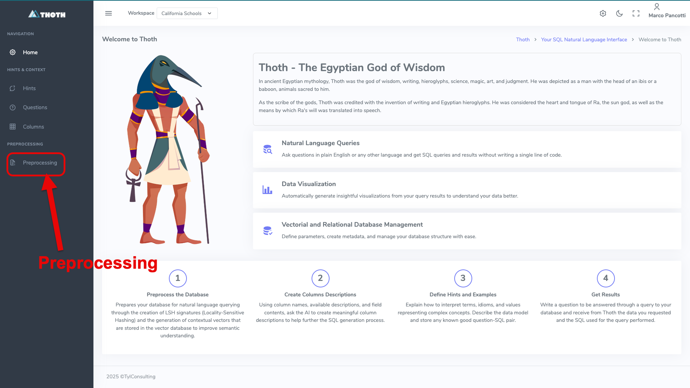
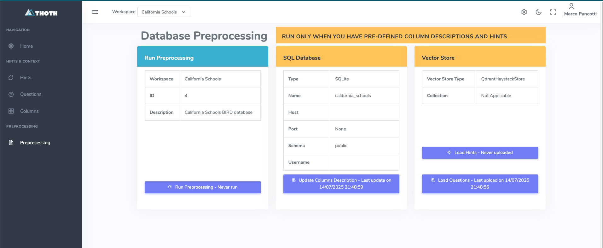
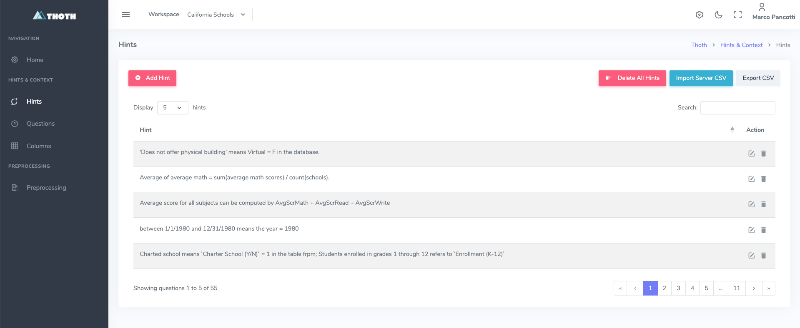
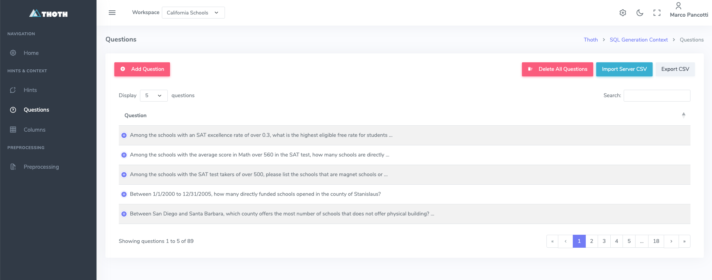
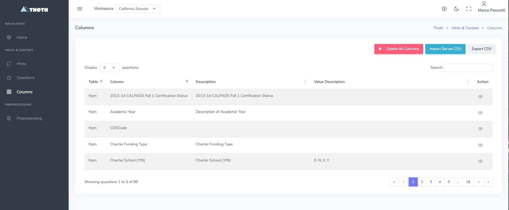
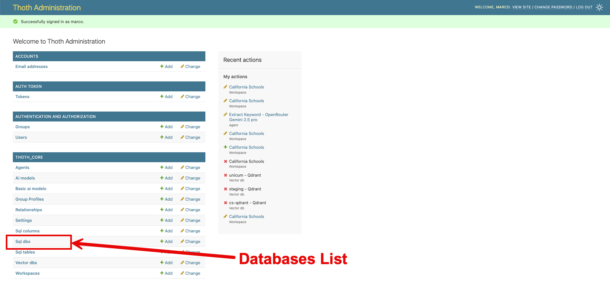
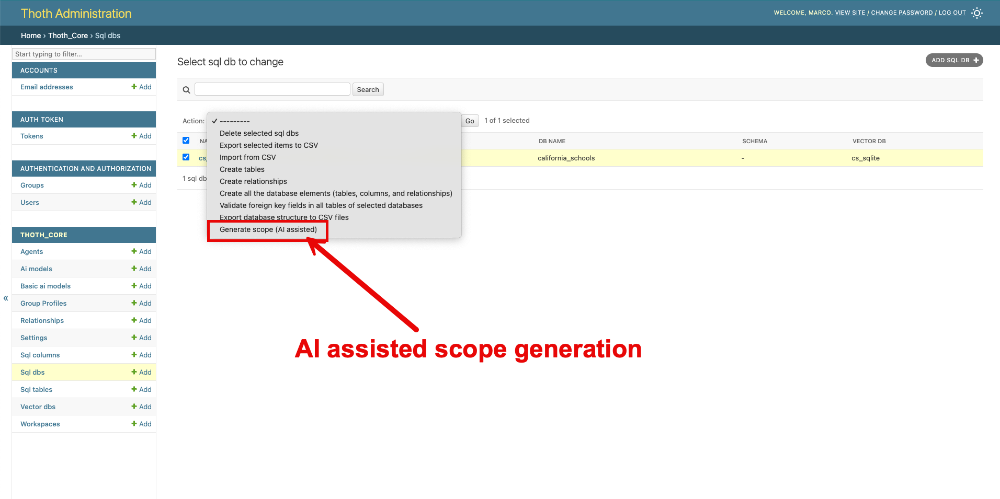
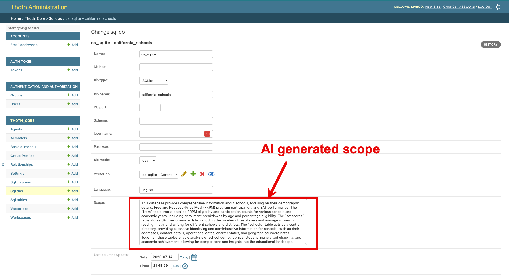

# Quick Setup

Il **Quick Setup** serve a permettere all'utente di completare l'installazione in pochi minuti in modo da poter fare pratica
con **ThothAI** prima di procedere ad un setup completo, con utenti e database reali.

L'idea su cui si basa il Quick Start è di utilizzare l'utente `marco` per esercitarsi sul database `california_schools`, un database `Sqlite` che contiene dati aggregati sulle scuole della California, che è stato preconfigurato nel setup di default. 

Il database `california_school.sqlite` si può trovare nella directory ```data/dev_databases/california_schools/``` del backend (Thoth)
e può essere facilmente esaminato tramite un tool come DBeaver o equivalente. Inoltre il file `dev.json`, disponibile nella stessa directory, contiene in formato json 
una serie di Question, di Hints e di SQL propri di quel database che sono utilizzati per il setup in fase di preprocessing.

Ovviamente è necessario, come prerequisito per poter lavorare col setup standard, aver acquistato, anche per soli 5/10 Dollari, una API Key di OpenRouter, sufficienti per centinaia di interrogazioni. 

Al posto di OpenRouter si possono utilizzare modelli in locale, ad esempio tramite Ollama, o provider diretti come OpenAI, Mistral o Anthropic.
In questo caso è necessario modificare il setup degli Agents per utilizzare AiModel diversi da quelli impostati come default, che sono tutti collegati a OpenRouter.

Le tre attività da fare per completare il setup prima di poter procedere a provare l'applicazione ThothAI sono le seguenti:

## 1 - Preprocessing
Andare su [http://localhost:8040](http://localhost:8040) (porta 8000 se l'installazione è stata fatta in locale)



Selezionare la pagina del Preprocessing



Eseguire in successione `Load Hints`, `Load Questions` e `Run Preprocessing`.
Non è necessario eseguire l'`Update Columns Descriptions` perché il comando `python manage.py load_defaults`, eseguito in fase di setup, ha già caricato le descrizioni delle Columns 
del database `California Schools`. 

Si vedrà in seguito se e come queste tre funzioni debbano essere utilizzata per database collegati successivamente al setup iniziale.

È possibile verificare l'effetto di queste funzioni esaminando il contenuto del database vettoriale tramite le specifiche gestioni.

### 1.1 - La gestione degli Hints
Gli Hints sono suggerimenti, o "evidence", che chiariscono come interpretare determinati termini e come determinare l'informazione richiesta partendo dal database.
Gli Hints vengono inseriti nei prompt di generazione e controllo del SQL per aiutare i modelli a comprendere la domanda e a mapparla rispetto allo schema.
Il setup di default legge gli Hints relativi al database `california_schools` dal file `dev.json` e li salva nel database vettoriale durante il preprocessing.
Per ulteriori dettagli vedere [la specifica pagina del Reference Manual](../4-reference_manual/4.4-hints.md)



### 1.2 - La gestione delle Questions
Le Questions sono l'associazione tra una domanda, un Hint e un 'Gold' SQL, cioè un SQL sicuramente in grado di rispondere alla domanda dato l'Hint.
Una preselezione di Questions, scelte da ThothAI per similarità rispetto alla domanda posta, vengono inserite nei prompt di generazione e controllo del SQL come "few shots".
Il setup di default legge le Questions relative al database `california_schools` dal file `dev.json` e le salva nel database vettoriale durante il preprocessing.
Per ulteriori dettagli vedere [la specifica pagina del Reference Manual](../4-reference_manual/4.5-questions.md)



### 1.3 - La gestione delle Columns
Le Columns sono le descrizioni delle Columns presenti nel database. Sono raccolte nel database vettoriale perché, nella fase 
di generazione dello "schema link', ThothAI usa la ricerca per similarità per pre-selezionare le Columns sulla base della 
loro probabilità di essere parte del SQL generato.
Il setup di default legge le Columns relative al database `california_schools` dal database stesso e le salva nel database vettoriale durante il preprocessing.
Per ulteriori dettagli vedere [la specifica pagina del Reference Manual](../4-reference_manual/4.6-columns.md)



## 2 - Generazione tramite AI dello scope del database California Schools
Lo `scope` del database è una descrizione dei contenuti del database che permette a ThothAI, tramite l'uso dell'AI', di capire se la domanda posta è pertinente rispetto al DB interrogato.
In ThothAI è disponibile una funzione che permette di usare l'AI per determinare lo `scope di un database.

Passare alla sezione Admin premendo `l'icona impostazioni` rappresentato dall'ingranaggio in alto a destra.


Ci si trova su questa form 



Aprire la lista degli `Sql dbs`, selezionare il db `cs_sqlite`, dalle action selezionare `Generate scope (AI assisted)` e premere su `Go`



Viene eseguita una richiesta al modello impostato come `Comment model` nel setting `Default` associato al workspace `California Schools`, quello su cui si sta operando.

Terminata l'operazione (il tempo dipende dalla complessità del database e dal LLM utilizzato), si può visualizzare il testo che descrive lo scope del database nella scheda del database. 
Questa informazione verrà utilizzata dal workflow di generazione del SQL per valutare se la domanda fatta è pertinente o completamente fuori contesto. 



La fase di setup necessaria per un rapido utilizzo dell'applicazione è terminata. A questo punto è possibile iniziare a utilizzare il frontend per eseguire le. interrogazioni
Per vedere come utilizzare ThothAI con la configurazione di default leggere l'apposita [sezione di questa documentazione.](../2-quickstart/2.1-quickstart_frontend.md)


