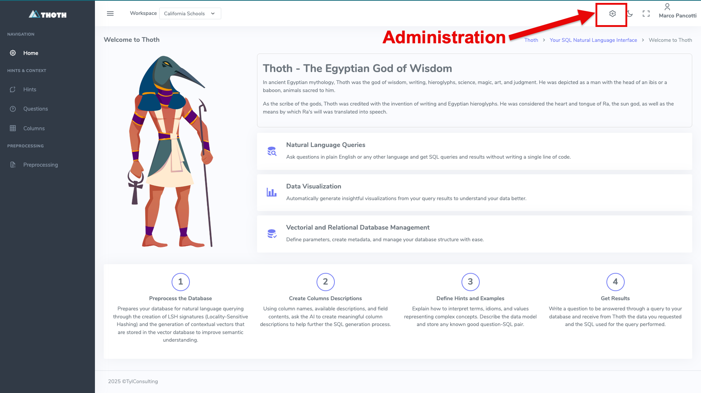
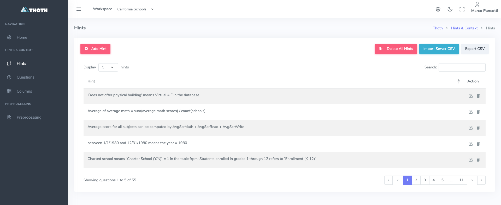
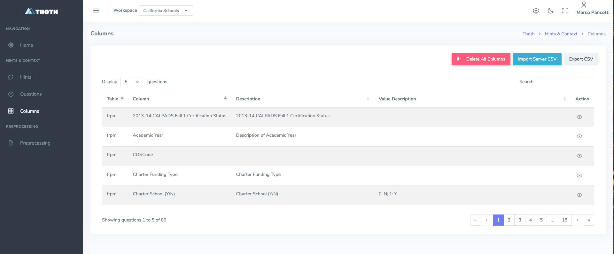
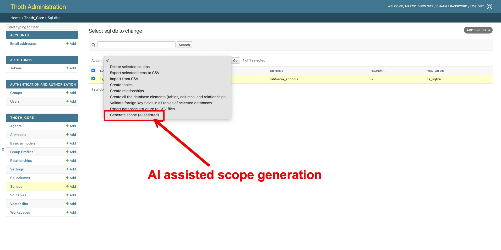
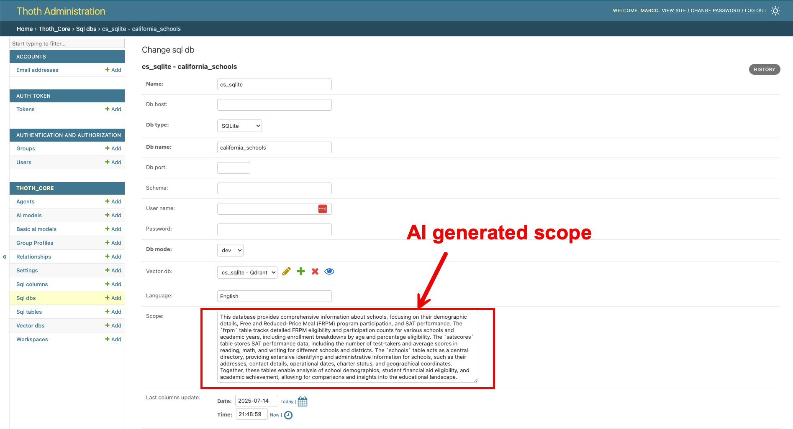

# Quick Setup

Il **Quick Setup** serve a permettere all'utente di completare l'installazione in pochi minuti in modo da poter fare pratica
con **ThothAI** prima di procedere a un setup completo, con utenti e database reali.

L'idea su cui si basa il Quick Start è di utilizzare l'utente `marco` per esercitarsi sul database `california_schools`, un database `Sqlite` che contiene dati aggregati sulle scuole della California, che è stato preconfigurato nel setup di default. 

Il database `california_school.sqlite` si può trovare nella directory ```data/dev_databases/california_schools/``` del backend (Thoth)
e può essere facilmente esaminato tramite un tool come DBeaver o equivalente. Inoltre il file `dev.json`, disponibile nella stessa directory, contiene in formato json 
una serie di Question, di Hints e di SQL propri di quel database che sono utilizzati per il setup in fase di preprocessing.

Ovviamente è necessario, come prerequisito per poter lavorare col setup standard, aver acquistato, anche per soli 5/10 Dollari, una API Key di OpenRouter, sufficienti per centinaia di interrogazioni. 

Al posto di OpenRouter si possono utilizzare modelli in locale, ad esempio tramite Ollama, o provider diretti come OpenAI, Mistral o Anthropic.

In questo caso è necessario modificare il setup degli Agents per utilizzare AiModel diversi da quelli impostati come default, che sono tutti collegati a OpenRouter.

Le tre attività da fare per completare il setup, prima di poter procedere a provare l'applicazione ThothAI, sono le seguenti:

## 1 - Assegnazione password all'utente `marco`

Gli utenti per il quick setup sono stati creati, ma non hanno password, per cui non ci si può autenticare con la loro identità. 


Per prima cosa, quindi, dalla homepage del backend Thoth, andare nell'area amministrativa, selezionando `l'icona impostazioni` rappresentato dall'ingranaggio in alto a destra.




Ci si ritrova nel contesto `admin`


Selezionando il link Users si accede alla lista degli user:


Selezionando lo user `marco` si accede alla form in cui si può fare il reset della password. Impostate la password che volete.
Nel proseguo di questo testo si ipotizza che abbiate assegnata la password  `thoth_pwd`

. 

Nel caso non fosse già inizializzato, selezionare il checkbok `Superuser status`
per assegnare all'utente `marco` i poteri necessari per gestire il backend di ThotAI.

Una volta assegnata la password si può fare logout e rientrare con l'utente marco. L'utente superuser precedentemente 
generato deve essere mantenuto nel database per avere una backdoor di accesso all'area amministrativa sempre disponibile.

--------------------

## 2 - Preprocessing
Andare su [http://localhost:8040](http://localhost:8040) (porta 8000 se l'installazione è stata fatta in locale)


Selezionare la pagina del Preprocessing


Eseguire in successione `Load Hints`, `Load Questions` e `Run Preprocessing`.
Non è necessario eseguire l'`Update Columns Descriptions` perché il comando `python manage.py load_defaults`, eseguito in fase di setup, ha già caricato le descrizioni delle Columns 
del database `California Schools`. 

Si vedrà in seguito se e come queste tre funzioni debbano essere utilizzata per database collegati successivamente al setup iniziale.

È possibile verificare l'effetto di queste funzioni esaminando il contenuto del database vettoriale tramite le specifiche gestioni.

### 2.1 - La gestione degli Hints
Gli Hints sono suggerimenti, o "evidence", che chiariscono come interpretare determinati termini e come determinare l'informazione richiesta partendo dal database.
Gli Hints vengono inseriti nei prompt di generazione e controllo del SQL per aiutare i modelli a comprendere la domanda e a mapparla rispetto allo schema.
Il setup di default legge gli Hints relativi al database `california_schools` dal file `dev.json` e li salva nel database vettoriale durante il preprocessing.
Per ulteriori dettagli vedere [la specifica pagina del Reference Manual](../5-reference_manual/5.4-hints/5.4-hints.md)



### 2.2 - La gestione delle Questions
Le Questions sono l'associazione tra una domanda, un Hint e un 'Gold' SQL, cioè un SQL sicuramente in grado di rispondere alla domanda dato l'Hint.
Una preselezione di Questions, scelte da ThothAI per similarità rispetto alla domanda posta, vengono inserite nei prompt di generazione e controllo del SQL come "few shots".
Il setup di default legge le Questions relative al database `california_schools` dal file `dev.json` e le salva nel database vettoriale durante il preprocessing.
Per ulteriori dettagli vedere [la specifica pagina del Reference Manual](../5-reference_manual/5.5-questions/5.5-questions.md)


### 2.3 - La gestione delle Columns
Le Columns sono le descrizioni delle Columns presenti nel database. Sono raccolte nel database vettoriale perché, nella fase 
di generazione dello "schema link', ThothAI usa la ricerca per similarità per pre-selezionare le Columns sulla base della 
loro probabilità di essere parte del SQL generato.
Il setup di default legge le Columns relative al database `california_schools` dal database stesso e le salva nel database vettoriale durante il preprocessing.
Per ulteriori dettagli vedere [la specifica pagina del Reference Manual](../5-reference_manual/5.6-columns/5.6-columns.md)



## 3 - Generazione tramite AI dello scope del database California Schools
Lo `scope` del database è una descrizione dei contenuti del database che permette a ThothAI, tramite l'uso dell'AI', di capire se la domanda posta è pertinente rispetto al DB interrogato.
In ThothAI è disponibile una funzione che permette di usare l'AI per determinare lo `scope di un database.

Passare alla sezione Admin premendo `l'icona impostazioni` rappresentato dall'ingranaggio in alto a destra.


Ci si trova su questa form 


Aprire la lista degli `Sql dbs`, selezionare il db `cs_sqlite`, dalle action selezionare `Generate scope (AI assisted)` e premere su `Go`



Viene eseguita una richiesta al modello impostato come `Comment model` nel setting `Default` associato al workspace `California Schools`, quello su cui si sta operando.

Terminata l'operazione (il tempo dipende dalla complessità del database e dal LLM utilizzato), si può visualizzare il testo che descrive lo scope del database nella scheda del database. 
Questa informazione verrà utilizzata dal workflow di generazione del SQL per valutare se la domanda fatta è pertinente o completamente fuori contesto. 



La fase di setup necessaria per un rapido utilizzo dell'applicazione è terminata. A questo punto è possibile iniziare a utilizzare il frontend per eseguire le. interrogazioni
Per vedere come utilizzare ThothAI con la configurazione di default leggere l'apposita [sezione di questa documentazione.](../2-quickstart/2.1-quickstart_frontend.md)


```bash
docker ps
```

Deve comparire una lista come la seguente:


A questo punto si può procedere alla [fase successiva](../1-install/1.5-quick_setup.md)


La prima colonna a sinistra mostra gli ID dei container presenti. Individuare l'ID di `thoth-be` e copiarlo in memoria.

Accedere al container eseguendo il comando
```bash
docker exec -it thoth-be-id-just-copied /bin/bash
```

Ora si può procedere a eseguire i comandi necessari per la configurazione minima di default.

### 1.4 - Creazione di un superuser
Il primo comando crea un utente superuser da utilizzare per accedere al backend.
```bash
uv run python manage.py createsuperuser
```

Rispondere alle domande poste da Thoth (in quanto applicazione Django) e creare un utente superuser, utilizzando uno username diverso da quello che avranno gli utenti reali.

###  1.5 - Setup iniziale
Procedere quindi a caricare un setup base completo e consistente da usare come setup minimo iniziale.
```bash
uv run python manage.py load_defaults --source=docker
```

!!! note "Attenzione al parametro --source!"

    È importante indicare `--source=docker`, in quanto alcuni parametri per il deploy sotto Docker sono diversi rispetto a quelli usati per il deploy in locale.
    
    Nel caso abbiate sbagliato, tenete conto che la procedura di `load_defaults` può essere ripetuta, e che il parametro fondamentale da verificare è il VectorDb `cs_sqlite`, che deve avere come `host=thoth-qdrant` e non `localhost`.

Con il comando `load_defaults` si creano cinque gruppi (Admin, Editor, BasicUser, TechUser e DebugUser) e due utenti (marco e maria).
Inoltre, si crea un setup completo per modelli AI, agenti, database e workspace con delle configurazioni base funzionanti, associate agli utenti marco e maria, che possono essere usate come template per i futuri utenti reali.

#### Opzioni di pulizia selettiva per risolvere conflitti

Se durante l'esecuzione di `load_defaults` si ricevono errori di tipo "UNIQUE constraint failed", è possibile utilizzare le opzioni di pulizia selettiva per rimuovere i dati esistenti prima del caricamento:

```bash
# Pulisce solo la struttura del database e i workspace (risolve la maggior parte dei conflitti)
uv run python manage.py load_defaults --source=docker --clean-db-structure --clean-workspaces

# Pulisce tutto tranne utenti e gruppi
uv run python manage.py load_defaults --source=docker --clean-db-structure --clean-workspaces --clean-ai-config --clean-vector-dbs

# Pulisce TUTTO (attenzione: cancella anche gli utenti superuser!)
uv run python manage.py load_defaults --source=docker --clean-all
```

**Opzioni disponibili:**
- `--clean-db-structure`: Rimuove SqlDb, SqlTable, SqlColumn e Relationship
- `--clean-workspaces`: Rimuove i Workspace esistenti
- `--clean-ai-config`: Rimuove AiModel, BasicAiModel, Agent e Setting
- `--clean-vector-dbs`: Rimuove le configurazioni VectorDb
- `--clean-users`: Rimuove User e Group (⚠️ ATTENZIONE: cancella TUTTI gli utenti inclusi i superuser!)
- `--clean-all`: Rimuove tutti i dati sopra elencati

Queste opzioni sono particolarmente utili quando si clona il progetto su un nuovo sistema e si vuole garantire che non ci siano conflitti con ID preesistenti.

## 2 - Installazione dell'applicazione di frontend, ThothUI
Una volta installato il backend, si può installare il frontend, dal nome **ThothUI**. Entrare quindi nel progetto **ThothUI** e procedere come segue:

### 2.1 - Impostazione del file _env
Se è stato eseguita la install.sh (install.bat) il file _env.templaate è stato già copiato in _env. 
Altrimenti bisogna copiare `_env.template` in `_env` e compilare i placeholder necessari. 
Devono essere necessariamente inserite le key di Django `DJANGO_API_KEY` e di almeno un provider LLM. La key di Logfire è fortemente consigliata, ma non obbligatoria.

### 2.2 - Esecuzione del docker-compose up

```bash
docker-compose up --build -d
```

## 3 - Verifica del funzionamento dell'applicazione sotto Docker

### 3.1 - Verifica del backend
Per verificare il backend è possibile aprire [http://localhost:8040](http://localhost:8040) e fare login con l'utente superuser appena creato.

Ci si ritroverà di fronte a questa form:


Cliccando sull'icona in alto a destra, evidenziata col contorno in rosso, è possibile accedere all'area amministrativa:


Cliccando sul link "view site" si torna alla Home Page del backend.

### 3.2 - Verifica del frontend
Per verificare il frontend è possibile andare su [http://localhost:8501](http://localhost:8501) e fare login sempre con credenziali `marco/thoth_pwd`. 

Ci si trova di fronte a questa form:


## 4 - Conclusione

Le due componenti di **ThothAI**, denominate **Thoth** e **ThothUI**, sono ora "up and running" su Docker e si può passare al completamento della loro configurazione.
Per un setup rapido, che fa uso dei default e dura pochi minuti, andare alla pagina dove viene descritto il [Quick Setup](1.4-quick_setup.md).

In seguito si potrà realizzare un setup completo, con nuovi utenti, nuovi gruppi, nuovi database, ecc. 
Per farlo, partire dalla [pagina di setup dello User Manual](../3-user_manual/3.1-setup/3.1.0-setup_process.md).

