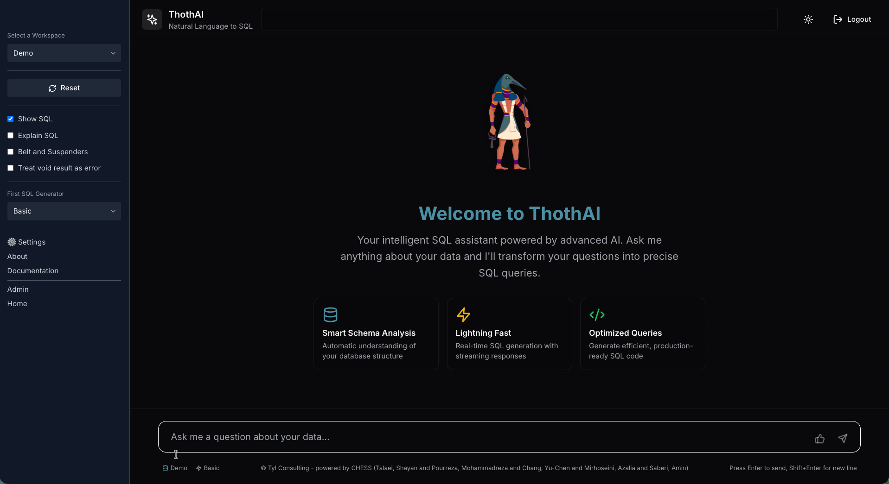
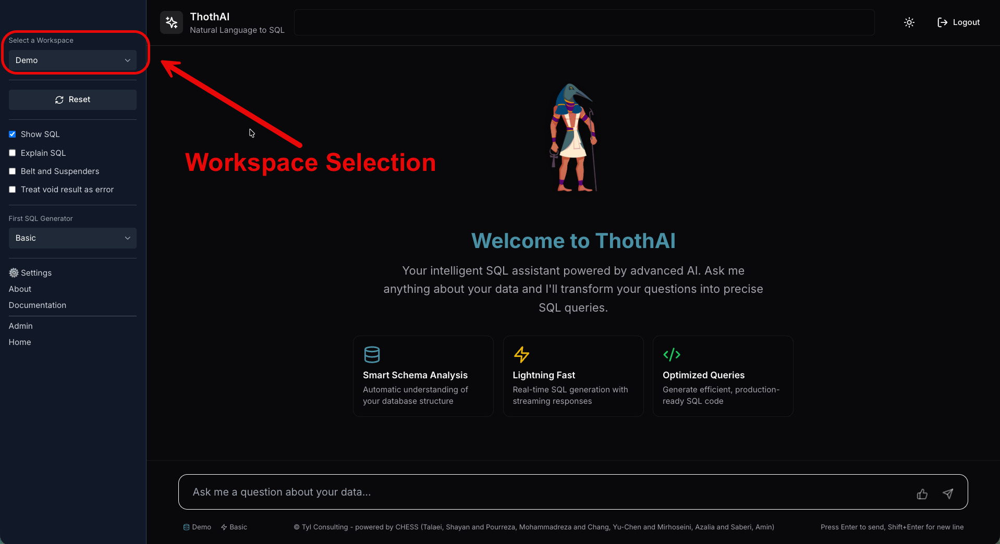
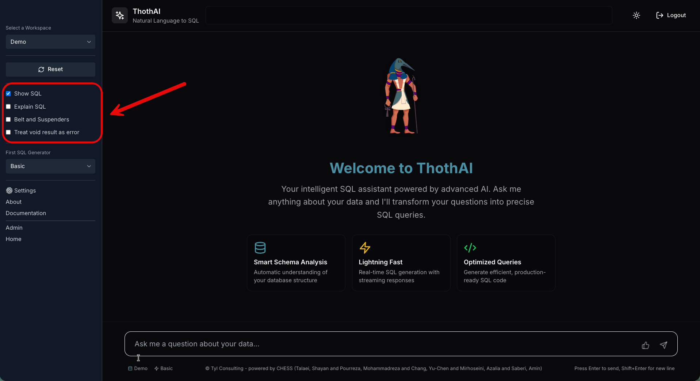
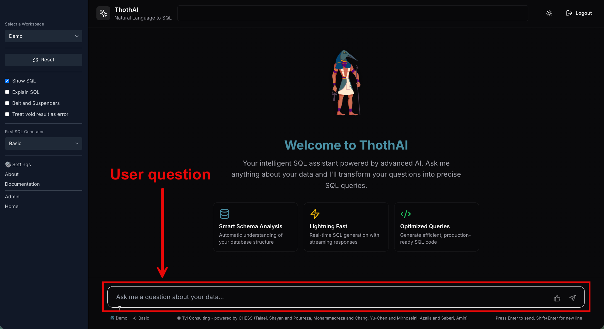
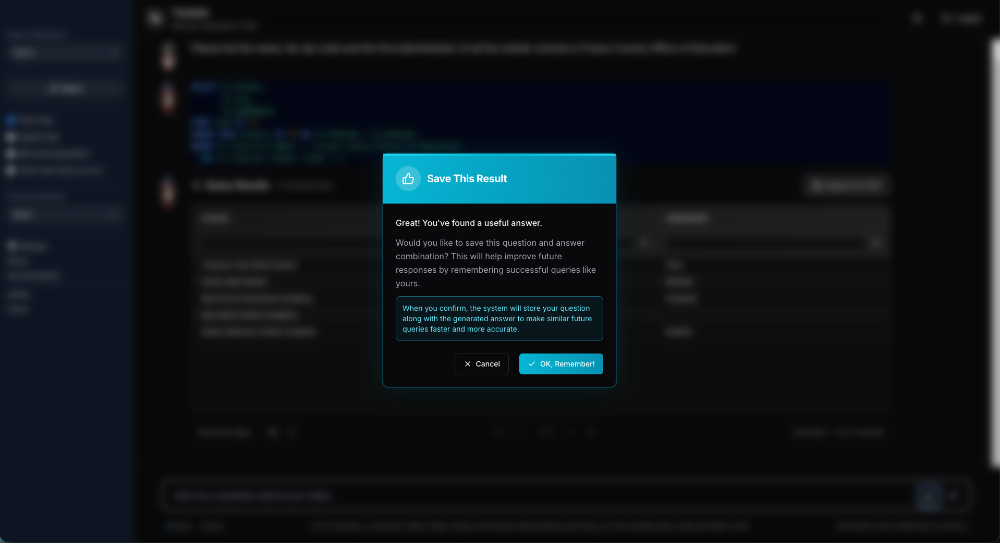

# Quick Start

L'installazione sotto Docker include il setup di tutto ciò che è necessario per provare subito ThothAI con il database di esempio California Schools.

## 1. Test rapido di ThothAI

- **Login immediato**: è già presente l'utente `demo` con password `demo1234` associato al workspace `demo`.
- **Workspace demo**: il workspace `demo` utilizza il database `california_schools` collegato alla collection `california_schools`.
- **Accesso**:
    - Backend (Django): [http://localhost:8040](http://localhost:8040))
    - Frontend (ThothUI): [http://localhost:3040](http://localhost:3040)

**Prova subito**: accedi al frontend con `demo/demo1234` e formula domande in linguaggio naturale sul database `california_schools`.

### 1.1 Esempi pronti (data/dev.json)

Alla root del progetto, nella directory `data`, trovi il file `dev.json`. Contiene quasi 90 esempi tra domande, hint e SQL di riferimento per il database `california_schools`.
Questi contenuti sono usati dal setup demo per preprocessing e generazione dei Gold SQL.

## 2. Quick Start Frontend

Il frontend, se si sta operando sotto Docker, è disponibile all'indirizzo [http://localhost:3040](http://localhost:3040).

### 2.1 Form iniziale

Una volta fatto il login con le credenziali **demo/demo1234**, si accede a questa form:

La form è divisa in una sidebar, a sinistra, e in un'area centrale che occupa tutto il resto dello schermo disponibile.

## 3. Sidebar

In alto a sinistra della sidebar c'è il selettore del workspace su cui si vuole lavorare.

Il setup di default prevede l'attivazione del solo workspace **California Schools**, per cui, fino a quando non si aggiungono nuovi workspace, non è possibile fare altre scelte.

## 4. Parametri di visualizzazione

Al centro della sidebar ci sono i parametri che guidano le informazioni che l'utente riceverà al termine dell'esecuzione delle interrogazioni.

I valori della sidebar sono quelli assegnati al gruppo User a cui l'utente appartiene. È possibile modificare il default in ogni momento.

I dati mostrati saranno:

- **La tabella dei dati**, risultato dell'esecuzione del SQL generato. Questa tabella verrà mostrata sempre, indifferentemente da quali opzioni si siano state scelte.
- **Opzione Show SQL**: se selezionata, verrà mostrata l'istruzione SQL generata che è stata utilizzata per ottenere la tabella dei dati risultato. Questa opzione viene normalmente abilitata solo per gli utenti più tecnici, che sono in grado di comprendere l'SQL.
- **Opzione Explain SQL**: se selezionata, al piede della tabella dati verrà mostrata una descrizione testuale, sotto forma di punti elenco, del SQL generato, che chiarisca i passaggi seguiti per ottenere la tabella dei dati risultato. Normalmente, questa opzione è disabilitata per gli utenti più tecnici, che comprendono l'SQL, mentre è abilitata per gli utenti meno tecnici, che non sono in grado di comprendere l'SQL.

Vi sono poi due opzioni che determinano non tanto cosa l'utente vedrà, quanto come si comporta l'applicazione al suo interno:

- **Belt and Suspenders**: se abilitata, il processo di selezione del SQL da utilizzare sarà a tre stadi, uno di **generazione**, uno di **test** e uno di ulteriore **revisione**. Se disabilitato, la fase di revisione non verrà eseguita, il che comporta una maggiore velocità, ma anche una maggiore probabilità di selezionare un SQL valido ma non ottimale.
- **Treat Empty Result as Error**: se abilitato, verrà considerata come query fallita una query che produce come risultato una lista vuota. Da abilitare solo se si è sicuri che la richiesta sia sicuramente destinata a produrre risultati non vuoti.

## 5. Reset

La pressione del tasto Reset permette di interrompere l'attività in ogni momento, anche durante l'esecuzione del workflow di generazione del SQL.

L'effetto della sua pressione, oltre all'interruzione del workflow, è l'azzeramento di tutte le cache e il reset di tutte le variabili di lavoro.
Infine, premendo il Reset, la form di gestione viene ripulita di tutti i messaggi e riproposta, vuota, per una nuova richiesta.

## 6. First SQL Generator

Nella sidebar appare un selettore del `First SQL Generator`.

Il workflow della generazione del SQL, in grado di rispondere alla domanda posta dall'utente, prevede una escalation di modelli sempre più complessi, e inevitabilmente più costosi, da coinvolgere nel processo.

In configurazione standard, ThothAI parte da un modello Basic per poi, dopo tre tentativi falliti, passare al modello Advanced e infine Expert. Ovviamente, perché avvenga una vera escalation, è opportuno che i tre Agent citati utilizzino modelli a complessità crescente. Ad esempio, rimanendo all'interno dell'offerta Anthropic a fine 2025, il Basic potrebbe essere Haiku 4.5, l'Advanced potrebbe essere Sonnet 4.5 e l'Expert potrebbe essere Opus 4.1.

Il selettore `First SQL Generator` permette di stabilire con quale Generator si vuole iniziare l'escalation. In base alla complessità del database, ad esempio, può essere opportuno saltare i generatori Basic e partire subito con un Advanced.

Il default di questo parametro è impostato a livello di workflow, in quanto ogni database può essere gestito con uno starter point diverso. L'utente può sempre modificare il valore di default e decidere di partire da un Advanced o, addirittura, da un Expert saltando i livelli precedenti.

In caso di fallimento anche dell'agente Expert, ThothAI è configurato per provare a usare la soluzione Titanic. Andare nell'apposita pagina del [Reference Manual](../5-reference_manual/5.3-workflow/5.3.4-titanic_generation_workflow.md) per esaminare in dettaglio di cosa si tratta.

Per una visione generale del Workflow implementato da ThothAI andare alla specifica [pagina del Reference Manual](../5-reference_manual/5.3-workflow/5.3.3-basic_generation_workflow.md).

## 7. Esecuzione della richiesta

Per fare una domanda e ricevere, come risposta, una tabella contenente la risposta, basta comportarsi come si fa davanti a una normale form di colloquio con un GPT.

È sufficiente inserire la domanda nell'apposito spazio e premere Invio. ThothAI provvederà ad eseguire il workflow partendo dal SQL Generator indicato ed evidenziando, nello spazio delle risposte, i messaggi richiesti.

L'output che verrà sempre esposto è la tabella risultato dell'interrogazione, che può anche essere composta da un unico record. Tutte le altre informazioni sono evidenziate solo se esplicitamente richieste.

Gli utenti più tecnici potranno sempre esaminare il log dell'esecuzione andando nel backend e selezionando l'opzione [XXX](XXX).

Un esempio di come può apparire la form alla fine dell'interrogazione è evidenziato di seguito.

## 8. Creazione di un Gold SQL

Nel caso il risultato della generazione sia considerato soddisfacente, è possibile creare un Gold SQL e salvarlo nel database vettoriale.

