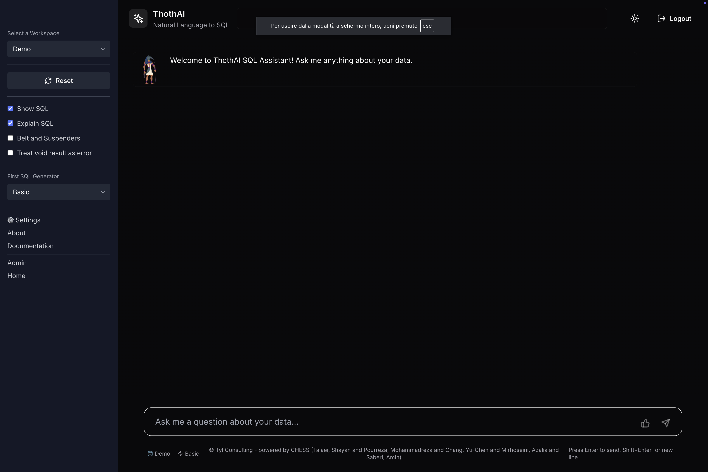
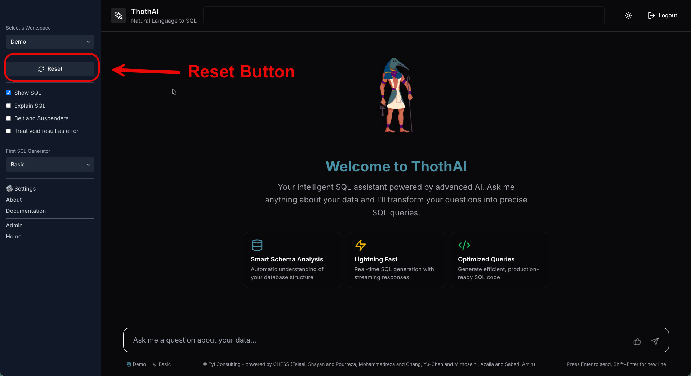
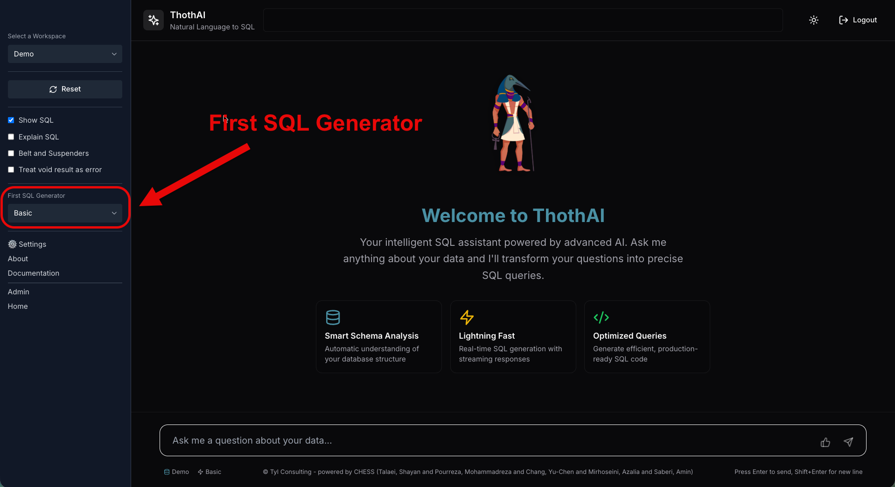
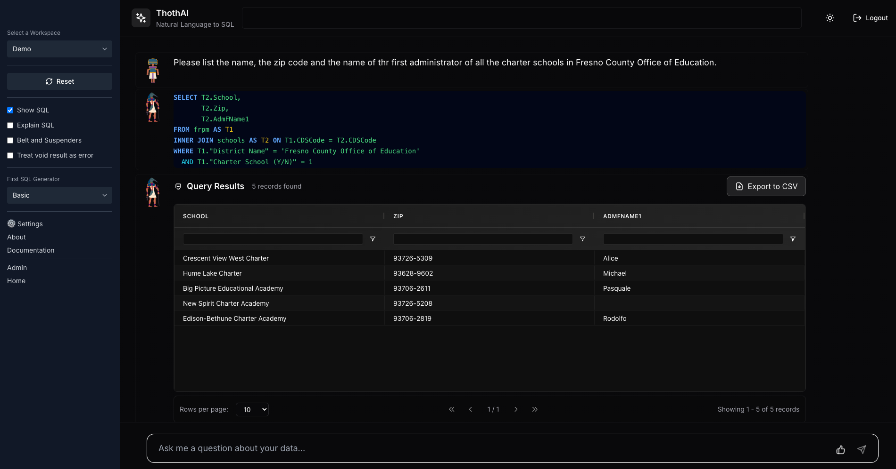

# Quick Start

The Docker-based installation includes the setup of everything you need to immediately try out ThothAI with the sample database California Schools.

## 1. Quick test of ThothAI

- **Immediate login**: the user `demo` with password `demo1234` is already available and associated with the `demo` workspace.
- **Demo workspace**: the `demo` workspace uses the `california_schools` database linked to the `california_schools` collection.
- **Access**:
    - Backend (Django): [http://localhost:8040](http://localhost:8040)
    - Frontend (ThothUI): [http://localhost:3040](http://localhost:3040)

**Try it now**: log in to the frontend with `demo/demo1234` and ask natural language questions on the `california_schools` database.

### 1.1 Ready‑made examples (data/dev.json)

At the project root, in the `data` directory, you will find the `dev.json` file. It contains almost 90 examples of questions, hints and reference SQL for the `california_schools` database.
These contents are used by the demo setup for preprocessing and for generating Gold SQLs.

## 2. Quick Start Frontend

When running under Docker, the frontend is available at [http://localhost:3040](http://localhost:3040).

### 2.1 Initial form

Once you have logged in with the **demo/demo1234** credentials, you will see the following form:

The form is divided into a sidebar on the left and a central area that occupies all the remaining available screen space.

## 3. Sidebar

At the top left of the sidebar there is the selector for the workspace you want to work on.

The default setup enables only the **California Schools** workspace, so until you add new workspaces, no other choices are available.

## 4. Display parameters

In the middle of the sidebar there are the parameters that control what information the user will receive at the end of the query execution.

The values in the sidebar are those assigned to the User group the current user belongs to. You can change the default at any time.

The information shown will be:

- **The data table**, the result of executing the generated SQL. This table **is always shown**, regardless of which options are selected.
- **Show SQL option**: if enabled, the generated SQL statement that was used to obtain the result data table will be shown. This option is usually **enabled only for more technical users** who are able to understand SQL.
- **Explain SQL option**: if enabled, at the bottom of the data table a textual description will be shown, as a bulleted list, of the generated SQL, explaining the steps followed to obtain the result data table. Typically, this option is **disabled for more technical users**, who already understand SQL, and **enabled for less technical users**.

There are then two options that determine not so much what the user will see, but how the application behaves internally:

- **Belt and Suspenders**: if enabled, the process of selecting the SQL to use will be three‑stage: **generation**, **test** and additional **review**. If disabled, the review stage is skipped, which makes the process faster but also increases the chances of selecting a valid but non‑optimal SQL.
- **Treat Empty Result as Error**: if enabled, a query that returns an **empty list** as result will be considered a failed query. Enable this only if you are sure that the request should always produce a non‑empty result set.

## 5. Reset

Pressing the Reset button allows you to interrupt the activity at any time, even while the SQL generation workflow is running.

In addition to stopping the workflow, pressing Reset clears all caches and resets all working variables.
Finally, pressing Reset clears all messages from the form and shows it again, empty, ready for a new request.

## 6. First SQL Generator

In the sidebar you will also find a selector for the `First SQL Generator`.

The SQL generation workflow, which is responsible for producing an SQL statement that answers the user question, is based on an **escalation** of models that become increasingly complex (and inevitably more expensive) as they are engaged in the process.

In the standard configuration, ThothAI starts from a **Basic** model and, after three failed attempts, moves to an **Advanced** model and finally to an **Expert** model. Obviously, to have a meaningful escalation, the three Agents mentioned should use models with increasing complexity. For example, staying within Anthropic's offering at the end of 2025, Basic could be Haiku 4.5, Advanced could be Sonnet 4.5 and Expert could be Opus 4.1.

The `First SQL Generator` selector allows you to decide which Generator you want to start the escalation with. Depending on the complexity of the database, for example, it may be appropriate to skip the Basic generators and start directly with an Advanced one.

The default value of this parameter is set at workflow level, since each database can be managed with a different starting point. The user can always override the default and decide to start from an Advanced or even an Expert Generator, skipping the previous levels.

If the Expert agent also fails, ThothAI is configured to try the **Titanic** solution. The Titanic option, as described later, uses a very large model to obtain a potentially better result, at the cost of higher time and resource consumption.

## 7. Executing a request

To ask a question and receive a table containing the answer, you just need to behave as you would with a standard chat form, like with a GPT.

Type your question in the appropriate field and press Enter. ThothAI will run the workflow starting from the selected SQL Generator and will highlight, in the response area, the requested messages.

The output that is always shown is the result table of the query, which may even consist of a single record. All other information is shown only if explicitly requested.

More technical users can always inspect the execution log by going to the backend admin and selecting the `Thoth Logs` option.

An example of what the form may look like at the end of the query is shown below.

## 8. Creating a Gold SQL

If the generated result is considered satisfactory, you can create a Gold SQL and save it in the vector database.

At this point, the SQL generation cycle is complete and you can proceed with another question.