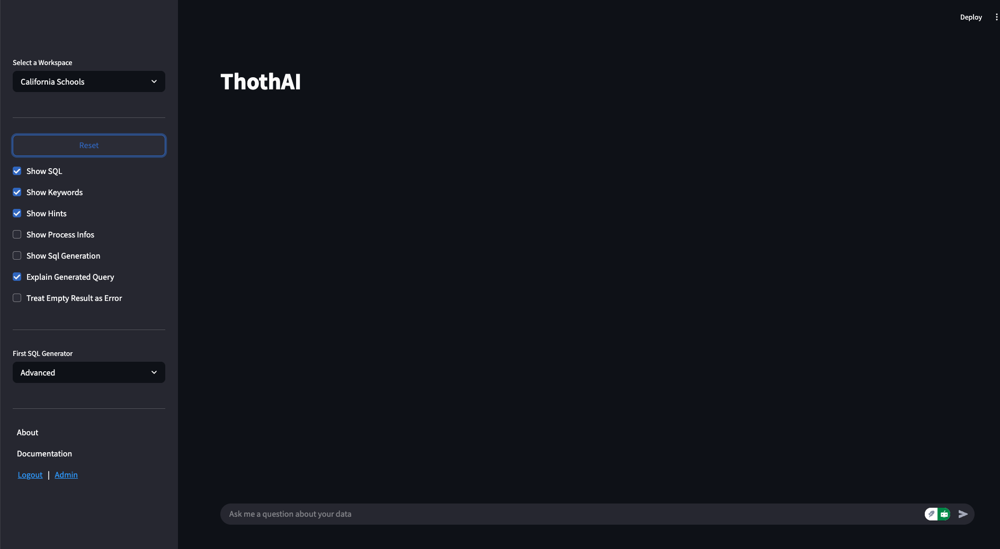

# Quick Start Frontend

Il [Quick Setup](../1-install/1.4-quick_setup.md) permette all'utente `marco` di operare sul database `california_schools` 
esprimendo domande, in Inglese, simili a quello che si possono trovare nel file `dev.json` disponibile nella
directory `data/dev_databases/california_schools` del backend `Thoth`.

Il frontend, se si sta operando sotto Docker, è disponibile all'indirizzo [http://localhost:8501](http://localhost:8501), 
mentre se si sta operando in locale è disponibile all'indirizzo [http://localhost:8503](http://localhost:8503)

## 1 - Form iniziale
Una volta fatto il login, con le credenziali **marco/thoth_pwd**, si accede a questa form:

La form è divisa in una sidebar, a sinistra, e in una form che occupa tutto il resto dello schermo disponibile. 

## 2 - Sidebar
In alto a sinistra del sidebar c'è il selettore del workspace su cui si vuole lavorare.

Il setup di default prevede l'attivazione del solo workspace **California Schools**, per cui il workspace, 
fino a quando non si aggiungono nuovi workspace, non permette altre scelte. 

## 3 - Parametri di visualizzazione
Al centro del sidebar ci sono i parametri che guidano le informazioni che l'utente riceve durante l'esecuzione delle
interrogazioni. 

Il valore del sidebar sono quelli assegnati al gruppo User a cui l'utente `marco`appartiene. È possibile modificare
il default in ogni momento. Lasciando i valori di default, a ogni interrogazione l'utente `marco` vedrà:

- quali sono le keyword estratte dalla domanda, sulla base delle quali sono state selezionate le tabelle e i campi 
- quali sono gli hints estratti, e passati ai modelli LLM, per aiutarli a comprendere la richiesta
- la tabella dei dati risultato dell'esecuzione del SQL generato
- una descrizione testuale, sotto forma di punti elenco, del SQL generato che chiarisca i .................

Utenti più "tecnici" possono vedere l'SQL generato, e altri, ancora più tecnici, o semplicementi più curiosi, 
possono seguire passo a passo l'esecuzione del processo. Andare alla pagina dei [Group Profiles](../4-user_manual/4.1-setup/4.1.4-authentication/3.1.1.3-group_profiles.md)
per una visione più approfondita delle conseguenze di queste impostazioni.

## 4 - Treat Empty Result as Error
Un flag particolare è quello denominato "Treat Empty Result as Error"

Una richiesta può condurre alla generazione di un SQL che, una volta eseguito, risulta formalmente corretto, ma produce come risultato una lista vuota.
Talvolta ciò significa che l'SQL generato è sbagliato, talvolta, invece, la domanda può aver fatto generare filtri troppo selettivi. Ad esempio:

- se chiedo "dimmi i clienti che hanno sede in Nord Italia" mi aspetto di trovarne qualcuno;
- se chiedo "dimmi i clienti che hanno sede nel comune di Gorgonzola, in via Padana 112" può essere che non ve ne sia nemmeno uno.

Il flag "Treat Empty Result as Error" serve apposta a comunicare a ThothAI se considerare un sintomo di errore (SQL formulato male) 
una eventuale lista vuota in risposta, oppure se accettarla come possibile esito della ricerca.

Il valore default per questo flag è False, cioè si accettano liste vuote in risposta. L'utente può decidere di volta in volta, valutando quanto selettiva 
è la richiesta che sta per fare, come impostare questo parametro.

## 5 - Reset
Sopra i flag che indirizzano i messaggi ricevuti dal backend, c'è il tasto Reset.

La pressione del tasto Reset permette di interrompere l'attività in ogni momento, anche durante l'esecuzione del  workflow.
L'effetto della sua pressione, oltre all'interruzione del workflow, è l'azzeramento di tutte le cache e il reset di tutte le variabili di lavoro. 
Infine, premendo il Reset, la form di gestione viene ripulita di tutti i messaggi e riproposta, vuota, per una nuova question.

!!!info

    E' una buona pratica, sia pure non strettamente necessaria, premere il tasto di Reset al termine di ogni interrogazione.
    In questo modo la form viene ripulita da tutti i messaggi della precedente interrogazione, evitando problemi di comprensione dei messaggi ricevuti. 

## 6 - First SQL Generator

Nella sidebar appare anche un selettore del `First SQL Generator`

Il workflow base della generazione del SQL, in grado di rispondere alla domanda posta dall'utente, prevede una escalation di modelli sempre più
complessi, e inevitabilmente più cari, da coinvolgere nel processo.

In configurazione standard, ThotAI parte da un modello Basic per poi, dopo tre tentativi falliti, passare al modello Advanced e infine Expert. Ovviamente, perché avvenga una vera escalation,
è opportuno che i tre Agent citati utilizzino modelli a complessità crescente. Ad esempio, rimanendo all'interno dell'offerta Anthropic a metà 
2025, il Basic potrebbe essere Sonnet 3.7, l'Advanced potrebbe essere Sonnet 4.0 e l'Expert potrebbe essere Opus 4.0.

Il selettore `First SQL Generator` permette di stabilire con quale Generator si vuole iniziare l'escalation. In base alla complessità
del database, ad esempio, può essere opportuno saltare i generatori Basic e partire subito con un Advanced.

Il default di questo parametro è impostato a livello di workflow, in quanto ogni database
può essere gestito con uno starter point diverso. L'utente può sempre modificare il valore di default e decidere di partire da un Advanced o, addirittura, da un Expert saltando i livelli precedenti.

In caso di fallimento anche dell'agente Expert, ThothAI è configurato per provare a usare la soluzione Titanic. Andare 
nell'apposita pagina del [Reference Manual](../5-reference_manual/5.3-workflow/5.3.4-titanic_generation_workflow.md) per vedere in dettaglio di cosa si tratta.

Per una visione generale del Workflow implementato da ThothAI andare alla specifica [pagina del Reference Manual](../5-reference_manual/5.3-workflow/5.3.3-basic_generation_workflow.md)

## 7 - Esecuzione della richiesta
Per fare una domanda e ricevere, come risposta, una tabella contenente la risposta, basta comportarsi come si fa davanti a una normale form di colloqui con un GPT.

È sufficiente inserire la domanda nell'apposito spazio e premere Invio. ThothAI provvederà ad eseguire il workflow partendo dal SQL Generator indicato 
ed evidenziando, nello spazio delle risposte, i messaggi richiesti.

L'output che viene sempre esposto è la tabella risultato dell'interrogazione, che può anche essere composta da un unico record. Tutte le. altre
informazioni sono evidenziate solo se esplicitamente richieste. Ricordo che si può scegliere di voler vedere:
- le Keywords estratte dalla domanda, utilizzate per le ricerche di similarità
- gli Hints estratti dal database vettoriale tramite ricerca di similarità con la domanda e con le keywords estratte;
- gli steps eseguiti, con evidenziazione dell'Agent incaricato;
- l'SQL generato; 
- Le specifiche richieste di generazione del SQL, tramite cui si può osservare l'escalation effettuata sui vari Agent;
- Una spiegazione "non tecnica" del SQL generato, che può accompagnare la presentazione del risultato della richiesta quando l'utente non ha le competenze per valutare l'SQL.

Un esempio di come può apparire la form alla fine dell'interrogazione è evidenziato di seguito.

