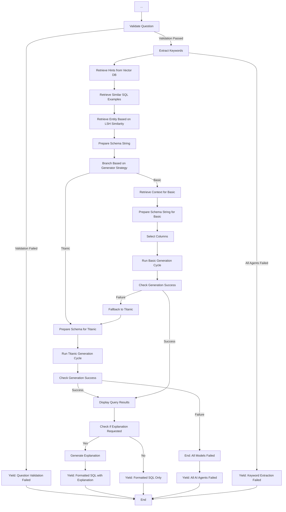

# Main

=== "Flowchart"

    ```mermaid
    graph TD
        A[Start: User Question] --> B[Initialize System State]

        B --> C[Set Vector DB]
        C --> D[Get Tentative Schema]
        D --> E[Select SQL Generator Strategy]
        E -->|Basic or Titanic| F[Setup State with DB Manager, Schema, Question]
        F --> G[Validate Question]

    ```

=== "Explanation"

    **Explanation of the Workflow (Part 1):**

    - **Start: User Question** - The process begins when a user poses a question.
    - **Initialize System State** - Initializes the state manager by creating a backup dictionary in the session state, if it doesn't exist.     
    This method ensures that the state manager has a place to store backup values for sidebar flags, workspace settings, and other persistent keys. It is called before any other state management operations.
    - **Set Vector DB** - Initializes and returns a vector database instance based on the provided workspace configuration.
    - **Get Tentative Schema** - Get the tentative schema from the database manager. It is named `tentative` because it reads the full definitions from the backend applications saved in the Thoth database as metadata in SQL DB, SQL tables, SQL columns and Relationships
    - **Select SQL Generator Strategy** - Reads the strategy to follow as decided by the user: Titanic means a couple of trials with two different big models, with a big context window. Titanic is suitable for smaller schemas (under 20-30 tables). With this approach, the AI is provided with:
        - The entire schema, enriched with table and column descriptions
        - Values extracted through LSH similarity
        - Relevant hints
        - Examples of question+SQL+hint triplets as few-shots
        
            A modern large model with a context window of at least 200k tokens can generate SQL without needing the schema to be reduced. 
            
            The Basic approach uses a cascade of smaller and cheaper models that works on a reduced database schema. If you want to use smaller models, or if the schema exceeds 20-30 tables, it's better to adopt the Basic strategy, which reduces the schema using LSH similarity and the vector database to identify tables and columns that are most likely to be useful, excluding those that appear irrelevant.
    
    - **Setup State with DB Manager, Schema, Question** - Sets up the system state and initializes all necessary tools for query processing.
    This function creates and configures the entity retrieval tool, context retrieval tool, schema selection tools, and initializes the system state with these tools.
    - **Validate Question** - Performs basic form validation on user input before SQL generation. It checks if text is meaningful (not gibberish), in the expected language, and potentially database-related. It returns a status code ("OK", "Meaningless", "Gibberish", "Unrecognized language", or "Out of scope") and a brief explanation. This activity, performed by an AI Agent, is intentionally permissive, focusing only on structural quality rather than semantic content or SQL feasibility.



