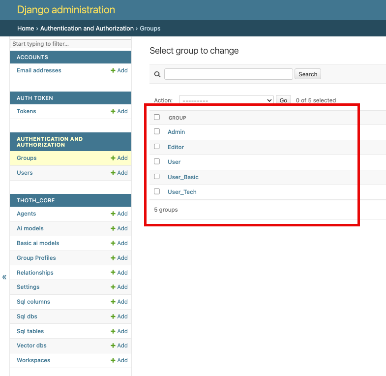

# Gestione dei Gruppi
Il backend di Thoth si basa su `Django`, un framework molto noto in ambito Python, che include un proprio sistema di autenticazione.

Nell'autenticazione di Django` un **gruppo** è un modo 
per categorizzare gli utenti e assegnare loro permessi e attributi in modo collettivo. 

In Thoth, il concetto di **gruppo** è stato esteso per offrire un controllo più granulare sull'esperienza utente, attraverso un [Profilo di Gruppo](3.1.1.3-group_profiles.md) che è associato a ogni gruppo standard di Django.

## 1 - Accesso ai gruppi

Alla gestione dei gruppi si accede tramite il menu presente nella sidebar delle pagine di amministrazione del backend.

Cliccando su Groups appare la lista dei gruppi disponibili.

Selezionando un gruppo, ad esempio il gruppo User, appare la seguente form:

Il setup di un gruppo prevede che, oltre al nome, vengano definiti
- i permessi attribuiti ai membri del gruppo
- il profilo del gruppo

## 2 - I permessi attribuiti ai membri del gruppo 

I permessi attribuibili a un gruppo possono essere di due tipi:

1. permessi standard di Django, che sono [descritti qui](https://docs.djangoproject.com/en/5.2/topics/auth/default/#groups)
2. permessi specifici di Thoth, che sono quelli il cui nome inizia con `Thoth_Core`.

La soluzione più rapida è quella di attribuire al gruppo Admin tutti i permessi previsti nella form di gestione, e lasciare senza alcun permesso tutti gli altri gruppi.

### 2.1 - A cosa servono i Gruppi in Thoth
I gruppi in Thoth servono a distinguere gli utenti tra:

   1. gli **Admin**, che possono gestire il setup del backend in termini di database, modelli, agenti e workspaces
   2. gli **Editor**, che non possono agire sul backend, ma possono gestire il contenuto del database vettoriale per operare su Hints, Column Descriptions e Questions e per eseguire il preprocessing 
   3. Gli **User** (possono esserci tanti gruppi di tipo User) che possono solo agire sul frontend sena poter contribuire al database vettoriale e tanto meno alla configurazione generale. Si tratta quindi di utilizzatori finali

Un utente quindi può essere, ad esempio:

- un semplice **User**, con un profilo che, durante la gestione del [workflow](../../../4-reference_manual/4.3-workflow/4.3.1-preliminary_steps.md), gli permette di vedere alcuni dei i messaggi che informano sull'avanzamento del processo
- uno **User_Basic**, che può vedere solo la tabella risultante dalla query e la spiegazione di come ci si è arrivati, 
- uno **User_Tech** , normalmente un utente con conoscenze di database, che vede tutti i dettagli del [workflow](../../../4-reference_manual/4.3-workflow/4.3.1-preliminary_steps.md)flow e l'istruzione SQL generata

Oltre che appartenere a un gruppo User, un utente può appartenere anche a:
- un gruppo **Editor**, acquisendo così l'autorizzazione ad aggiungere informazioni sul database vettoriale
- un gruppo **Admin**, acquisendo così l'autorizzazione ad amministrare i parametri generali dell'applicazione.

Il principio generale è che i poteri si sommano. Quindi tutti, per poter usare il frontend, devono essere un certo tipo di User. Chi è anche associato a un gruppo Editor e/o Admin aumenta i suoi poteri.

Il numero e il nome dei gruppi User non ha importanza. Il setup di default ne ha creati tre, ma se ne possono aggiungere altri, o se ne può cancellare qualcuno. 

Tutti i gruppi che non sono Editor e Admin possono essere trattati come gruppi User, indifferentemente dal nome che hanno. 
L'importante è che ai gruppi User e ai gruppi Editor non venga attribuito nessun potere amministrativo, cioè venga lasciato vuoto il primo box della maschera di gestione.

## 3 - Il Profilo del Gruppo

Quando si crea o si modifica un gruppo nell'interfaccia di amministrazione di Thoth, oltre al nome e ai permessi standard, è possibile configurare una serie di impostazioni aggiuntive che definiscono come gli utenti di quel gruppo interagiranno con il sistema.

Queste impostazioni sono raggruppate nella sezione "Group Profile Settings".

### 1.1 - Impostazioni di Visualizzazione

Le opzioni gestite dal Profilo di Gruppo controllano quali informazioni vengono mostrate agli utenti appartenenti al gruppo durante l'esecuzione del [workflow](../../../4-reference_manual/4.3-workflow/4.3.1-preliminary_steps.md) di generazione del SQL.

- **Show SQL**: Se attivato, gli utenti potranno vedere le query SQL generate dall'AI. Questo è utile per utenti tecnici che vogliono verificare le istruzioni SQL che sono state eseguite per ottenere i dati mostrati nella tabella di output.
- **Show keywords**: Se attivato, verranno mostrate le parole chiave estratte dalla richiesta dell'utente. Queste informazioni aiutano a capire qual'è stato il punto di partenza dell'AI per eseguire le ricerche di similitudine, per estrarre gli hints e per preselezionare tabelle e colonne da proporre al modello AI incaricato di generare l'SQL
- **Show hints**: Se attivato, gli utenti visualizzeranno i "suggerimenti" (hints) che il sistema ha trovato pertinenti alla richiesta. I suggerimenti sono informazioni pre-caricate che guidano l'AI nella generazione del SQL quando la richiesta contiene termini e "jargon" non direttamente riconducibili a tabelle e colonne, neanche utilizzando le descrizioni.
- **Show process info**: Se attivato, verranno mostrate informazioni dettagliate sul processo di elaborazione della richiesta, cioè i vari passaggi eseguiti da Thoth.
- **Show SQL generation**: Se attivato, l'utente potrà vedere quale Agente viene usato per la  generazione della query SQL, inclusi i passaggi intermedi e le decisioni prese dall'AI.
- **Explain generated query**: Se attivato, l'AI fornirà una spiegazione, in linguaggio naturale, della query SQL generata. Questo è particolarmente utile per utenti non tecnici per comprendere come l'interrogazione è stata gestita senza bisogno di conoscere l'SQL.

Ulteriori dettagli possono essere 

Le opzioni vengono passate al frontend al momento del login e faranno da default per la gestione dei messaggi mostrati durante l'esecuzione del [workflow](../../../4-reference_manual/4.3-workflow/4.3.1-preliminary_steps.md)