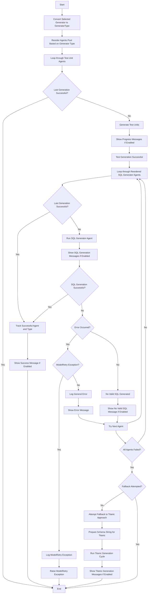

# Titanic GenerationWorkflow

```mermaid
flowchart TD
    Start[Start] --> ConvertType[Convert Selected Generator to GeneratorType]
    ConvertType --> ReorderPool[Reorder Agents Pool Based on Generator Type]
    ReorderPool --> LoopTU[Loop through Test Unit Agents]
    LoopTU --> SuccessCheckTU{Last Generation Successful?}
    SuccessCheckTU -->|Yes| End[End]
    SuccessCheckTU -->|No| GenTestUnits[Generate Test Units]
    GenTestUnits --> ShowMessageTU[Show Progress Messages if Enabled]
    ShowMessageTU --> TestSuccess[Test Generation Successful]
    TestSuccess --> LoopSQL[Loop through Reordered SQL Generator Agents]
    LoopSQL --> SuccessCheckSQL{Last Generation Successful?}
    SuccessCheckSQL -->|Yes| TrackSuccess[Track Successful Agent and Type]
    TrackSuccess --> ShowSuccess[Show Success Message if Enabled]
    ShowSuccess --> End
    SuccessCheckSQL -->|No| RunSQLAgent[Run SQL Generator Agent]
    RunSQLAgent --> ShowMessageSQL[Show SQL Generation Messages if Enabled]
    ShowMessageSQL --> SQLSuccess{SQL Generation Successful?}
    SQLSuccess -->|Yes| TrackSuccess
    SQLSuccess -->|No| ErrorCheck{Error Occurred?}
    ErrorCheck -->|Yes| ModelRetryCheck{ModelRetry Exception?}
    ModelRetryCheck -->|Yes| LogRetry[Log ModelRetry Exception]
    LogRetry --> RaiseRetry[Raise ModelRetry Exception]
    RaiseRetry --> End
    ModelRetryCheck -->|No| LogError[Log General Error]
    LogError --> ShowError[Show Error Message]
    ShowError --> NextAgent[Try Next Agent]
    NextAgent --> LoopSQL
    ErrorCheck -->|No| NoValidSQL[No Valid SQL Generated]
    NoValidSQL --> ShowNoValid[Show No Valid SQL Message if Enabled]
    ShowNoValid --> NextAgent
    NextAgent --> AllFailedCheck{All Agents Failed?}
    AllFailedCheck -->|Yes| FallbackCheck{Fallback Attempted?}
    FallbackCheck -->|No| AttemptFallback[Attempt Fallback to Titanic Approach]
    AttemptFallback --> PrepareSchema[Prepare Schema String for Titanic]
    PrepareSchema --> RunTitanic[Run Titanic Generation Cycle]
    RunTitanic --> ShowTitanicMessages[Show Titanic Generation Messages if Enabled]
    ShowTitanicMessages --> End
    FallbackCheck -->|Yes| End
    AllFailedCheck -->|No| LoopSQL
```