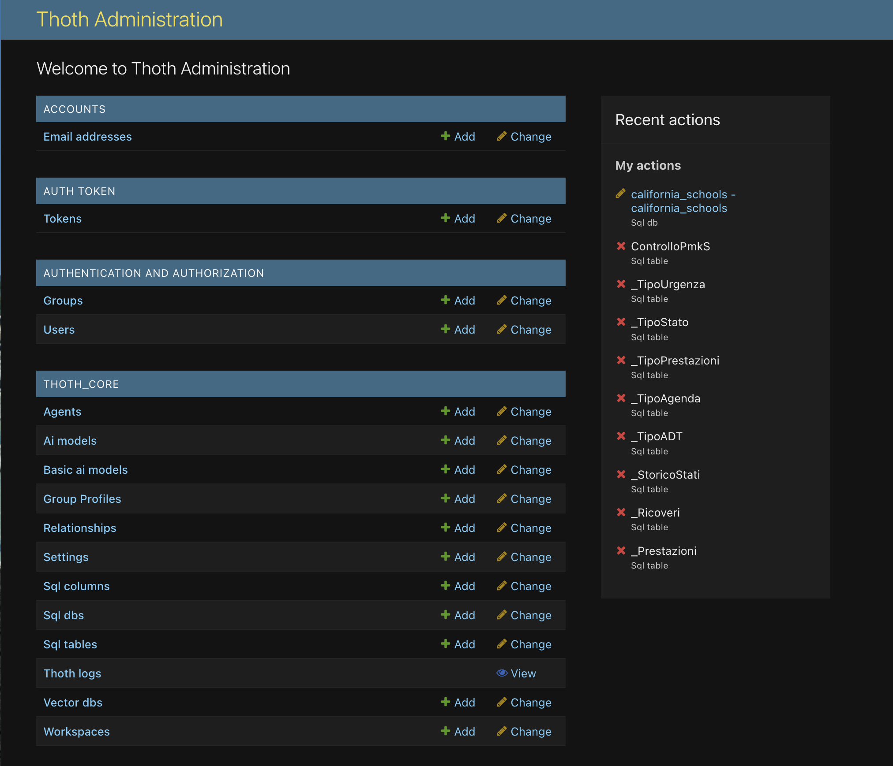

# Setup di ThothAI - Attività da Eseguire

Dopo aver completato l'installazione di base di ThothAI, è necessario eseguire alcune attività di configurazione per personalizzare il sistema secondo le proprie esigenze. 

Un'importante parte del setup avviene nell'area admin del prodotto, basata su Django

Di seguito sono elencate le attività principali da completare:

## 1. Completamento del Setup dei Gruppi

I Gruppi definiscono tre livelli di accesso:

- **Admin**: accesso all'area amministrativa
- **Editor**: creazione, modifica e cancellazione di Evidence, Questions e Columns nel database vettoriale
- **User**: visualizzazione selettiva degli output SQL in base al profilo (es. User_Basic vede solo la spiegazione in linguaggio naturale, User_Tech vede anche il SQL generato)

Associare ogni utente al gruppo più adatto al suo profilo e alle sue esigenze.

Per dettagli sulla gestione dei Gruppi consultare le pagine:

[:material-account-group: Gruppi](../4.1-setup/4.1.4-authentication/4.1.4.1-groups.md)

[:material-account-cog: Profili Gruppo](../4.1-setup/4.1.4-authentication/4.1.4.3-group_profiles.md)

La configurazione dei **Gruppi** è il primo passo ed è essenziale per il corretto funzionamento del sistema perché costituisce la base delle funzionalità di autorizzazione e, in parte, di gestione del workflow di esecuzione.

### Verifiche necessarie:

1. **Verificare l'esistenza dei Gruppi più importanti**

!!! tip "Verifica dei Gruppi"
   
    Assicurarsi che esistano i gruppi `Admin`, `Editor` e almeno un gruppo `User`.

!!! note "Gruppi predefiniti"
    Per impostazione predefinita, il comando `python manage.py import_groups`, eseguito automaticamente al momento dell'installazione in Docker, crea i seguenti gruppi:

    - **Admin**
    - **Editor**
    - **User_Basic**
    - **User**
    - **User_Tech**

2. **Verificare i permessi del gruppo Admin**

Controllare che al gruppo `Admin` siano associati tutti i poteri di amministrazione. È consigliato associare tutti i superuser di Django al gruppo Admin. 

3. **Configurare la visibilità delle azioni per Gruppo**

Verificare che il [Profilo di Gruppo](../4.1-setup/4.1.4-authentication/4.1.4.3-group_profiles.md) sia configurato correttamente, poiché determina quali informazioni ogni utente visualizza durante le ricerche in linguaggio naturale (vedi [Frontend](../4.5-frontend/4.5.1-frontend.md)). Modificare se necessario.

---

## 2. Creazione degli Utenti Reali

!!! tip "Utilizzo degli esempi"
Il comando `python manage.py import_users` eseguito durante l'installazione ha creato l'utente demo con password demo1234. Utilizzare questo utente come riferimento per la creazione degli utenti reali.

1. Analizzare la configurazione degli utenti di esempio
2. Creare gli utenti reali seguendo lo stesso schema
3. Associare ogni utente al gruppo di appartenenza appropriato

### Approfondimenti

[:material-account: Gestione Utenti](../4.1.4-authentication/4.1.4.2-users.md)

---

## 3. Verifica degli AI Models

!!! warning "Controllo modelli AI"
È fondamentale verificare che tutti i modelli necessari siano disponibili prima di procedere con la configurazione degli agenti.

### Attività da svolgere:

- Verificare che gli `AiModel` caricati siano tutti quelli necessari
- Il comando `import-all_csvs` ha creato configurazioni predefinite; aggiungere eventuali provider non inclusi nel setup di default secondo le proprie esigenze

### Approfondimenti

[:material-brain: AI Models](../4.1.3-AI_models_and_agents/4.1.3.2-ai_models.md){ .md-button .md-button--primary }

---

## 4. Verifica degli Agenti

!!! info "Configurazione agenti AI"
Gli agenti sono componenti fondamentali che utilizzano i modelli AI per eseguire specifiche operazioni.

### Controlli necessari:

- Verificare che siano presenti tutti gli `Agent` necessari
- Il comando `import-all_csvs` ha creato agenti predefiniti; aggiungere eventuali agenti personalizzati secondo le proprie esigenze

### Approfondimenti

[:material-robot: Agenti](../4.1.3-AI_models_and_agents/4.1.3.3-agents.md){ .md-button .md-button--primary }

---

## 5. Setup dei Database Vettoriali

!!! important "Relazione One-to-One: Collection e Database Relazionale"
Ogni database relazionale richiede una collection dedicata nel database vettoriale. La collection contiene metadati chiave (Evidence, Gold SQL) che arricchiscono il contesto per la generazione del SQL in linguaggio naturale.

### Configurazione richiesta:

- Configurare i database vettoriali utilizzati dall'applicazione (ThothAI include Qdrant in Docker per impostazione predefinita)
- Verificare la corretta associazione tra database vettoriali e database relazionali

### Approfondimenti

[:material-database: Database Vettoriali](../4.1.5-vector_db.md){ .md-button .md-button--primary }

---

## 6. Setup del Database Relazionale

!!! note "Database di destinazione"
Il database relazionale contiene i dati su cui eseguire le interrogazioni. Può essere configurato localmente, su Docker o su server esterni.

### Configurazione necessaria:

- Definire la connessione al database relazionale (host, porta, credenziali)
- Verificare la connettività e i permessi di accesso

### Approfondimenti

[:material-database-outline: Database SQL](../4.1.6-SQL_database/4.1.6.1-sql_dbs.md){ .md-button .md-button--primary }

---

## 7. Setup dei Settings

!!! note "Parametri di sistema"
I Settings contengono parametri fondamentali per il preprocessing e il frontend del sistema.

### Parametri da configurare:

- Impostazioni LSH Similarity per il preprocessing e la selezione dei dati per la generazione del SQL
- Criteri per l'utilizzo dello schema linking

### Approfondimenti

[:material-cog: Impostazioni](../4.1.8-Settings/4.1.8.1-settings.md){ .md-button .md-button--primary }

---

## 8. Setup del Workspace

!!! note "Ambiente di lavoro"
Il Workspace associa il database relazionale, gli Agenti AI e gli utenti autorizzati.

### Configurazioni richieste:

- Associare il database relazionale e gli agenti AI al workspace
- Configurare gli utenti e i loro permessi di accesso

### Approfondimenti

[:material-view-dashboard: Workspace](../4.1.7-workspaces.md){ .md-button .md-button--primary }

---

## Riepilogo

!!! success "Completamento setup"
Completando queste otto attività, il sistema ThothAI sarà configurato e pronto per l'utilizzo.

### Checklist finale:

- [ ] Gruppi configurati correttamente
- [ ] Utenti reali creati e associati ai gruppi
- [ ] AI Models verificati e completati
- [ ] Agenti configurati per le esigenze specifiche
- [ ] Database vettoriali configurati con una collection per ogni database relazionale
- [ ] Database relazionali configurati e testati
- [ ] Settings del sistema impostati correttamente
- [ ] Workspace configurati con le associazioni appropriate

!!! tip "Ordine di esecuzione"
Si consiglia di seguire l'ordine delle attività come presentato, in quanto alcune configurazioni dipendono dalle precedenti.
