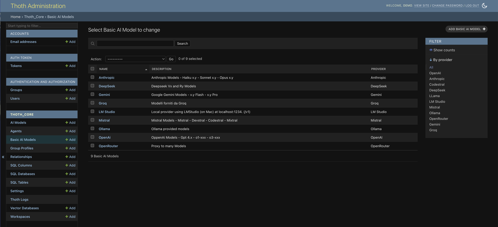
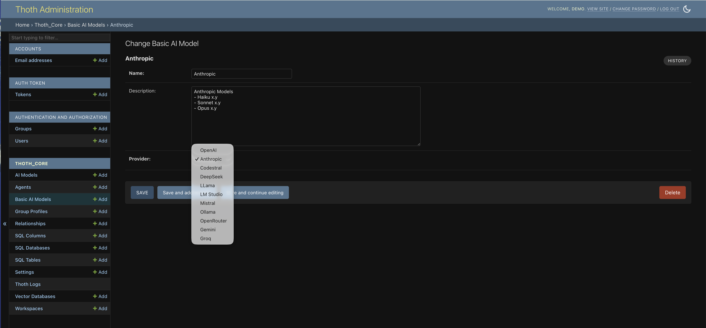

# Basic AI Models

Basic AI Models represent the **generic categories** of language models (LLMs) supported by ThothAI, grouped by provider. Each record defines a base provider, such as OpenAI, Anthropic, Mistral, etc.

This abstraction makes it possible to organize and centrally manage the different types of LLMs available in the system, acting as the foundation for configuring more specific models.

## 1 - Model structure

The `BasicAiModel` table contains the core information used to identify and describe a family of AI models.

### 1.1 - Model fields

The following fields define a Basic AI Model:

- **Name**: A unique name identifying the model family (e.g. "OpenAI", "Anthropic"). This field is mandatory and must be unique.
- **Description**: An optional text field used to capture a detailed description of the model family or provider.
- **Provider**: Specifies the language-model provider. The value is selected from a predefined list that includes options such as:
    - `OpenAI`
    - `Anthropic`
    - `CodeStral`
    - `DeepSeek`
    - `Llama`
    - `LM Studio`
    - `Mistral`
    - `Ollama`
    - `OpenRouter`
    - `Gemini`
    - `Grok`