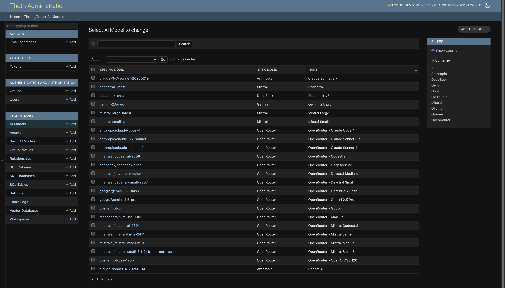
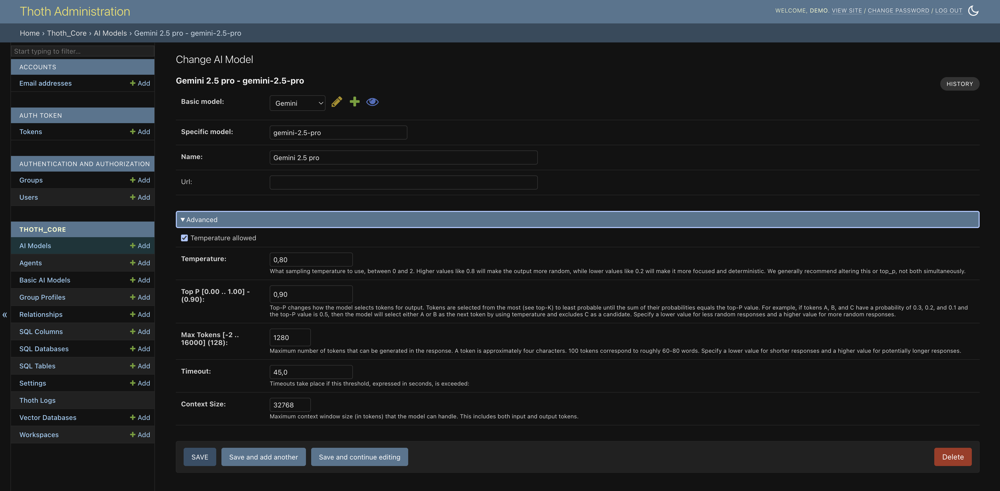

# AI Models

In ThothAI, configuring Large Language Models (LLMs) is a crucial step that determines the system's ability to understand natural-language requests and generate SQL queries. Model management is split into two main entities: **Basic AI Models** and **AI Models**. This structure provides flexibility and organization.

## 1 - AI Models overview

An **AI Model** is a specific version of a `BasicAiModel`. It lets you define the exact parameters for a model (e.g. "Claude 4.5 Haiku") and optionally associate dedicated access credentials (API key).

### 1.1 - Relationship with Basic AI Models

There is a **one-to-many** relationship between `BasicAiModel` and `AiModel`. A single `BasicAiModel` (e.g. "Anthropic") can have multiple `AiModel` entries, each with a different configuration (e.g. "Claude 4.5 Haiku", "Claude 4.5 Sonnet", "Claude 4.1 Opus").

### 1.2 - Model fields

The admin form for AI Models is split into two sections for clarity.

#### 1.2.1 - Main section

This section contains identification and access information:

*   **Basic model**: A dropdown to select the `BasicAiModel` this configuration belongs to.
*   **Specific model**: The technical name or identifier provided by the vendor (e.g. `sonnet-4.5`).
*   **Name**: A descriptive label for this configuration (e.g. `Claude Sonnet 4.5`).
*   **API Key**: The API key used to authenticate with the LLM service. For security, only the last four characters are shown. To update it, enter a new value; to delete it, leave the field empty. If the API key is omitted, the general API key configured at the BasicAiModel level is used.
*   **Url**: Optional field for specifying a custom endpoint, useful for self-hosted models or services that require a non-standard URL.

#### 1.2.2 - “Advanced” section

This collapsible section contains technical parameters that influence model behavior:

*   **Temperature allowed**: Boolean selector that lets you override the temperature at agent level. Some providers (e.g. Gemini) do not allow this, so the temperature value is ignored in that case.
*   **Temperature**: Numerical value (0.0–2.0) controlling the model’s “creativity.” Lower values (e.g. 0.2) yield deterministic answers; higher values (e.g. 0.8) produce more diverse outputs.
*   **Top P**: Numerical value (0.0–1.0) representing an alternative to temperature for randomness control. The model selects tokens whose cumulative probability sum is below this threshold.
*   **Max Tokens**: Maximum number of tokens the model can generate in a single response.
*   **Timeout**: Maximum time, in seconds, the system waits for a response before aborting the request.
*   **Context size**: Maximum number of tokens the model can use as context for generating a response.

**The most critical value to configure is currently the Context size**, which must match the provider’s declared context window. It directly influences ThothAI’s decision to use a reduced schema (Schema Linking) when needed.

