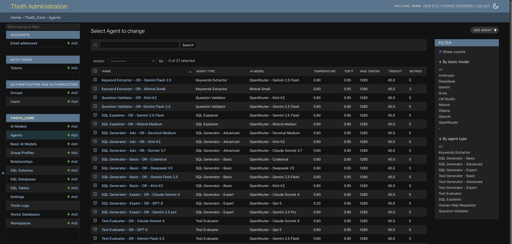
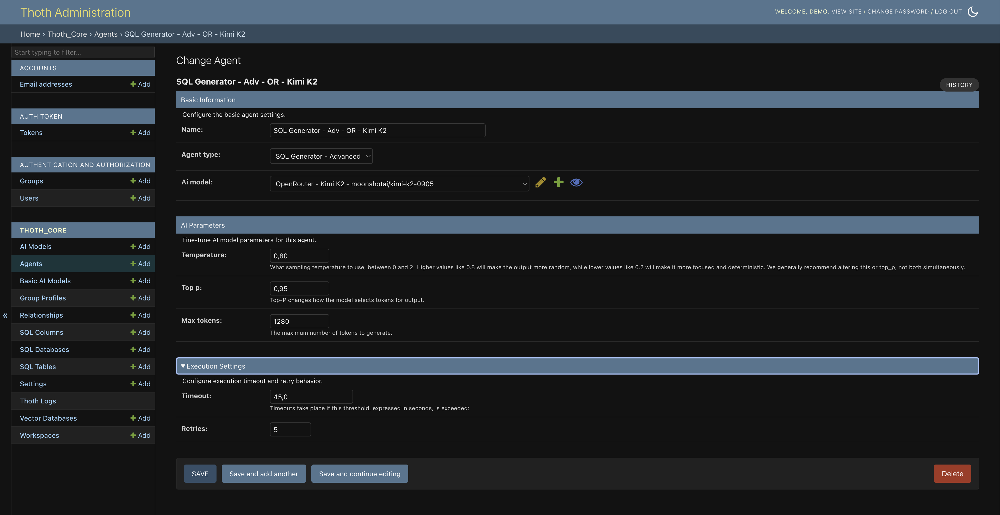

# Agents

Agents in ThothAI are specialized entities that leverage AI Models to perform specific tasks within the SQL generation workflow. Because the frontend’s SQL Generator relies on agent classification to populate the UI (and to manage escalation between generators), the way agents are organized plays a central role.

## 1. Agent types

ThothAI provides multiple agent types, each designed for a specific phase of the process. These types are predefined in the system and can be selected when creating or editing an agent. The frontend automatically populates the `sql_generator` sidebar based on the agents mapped in the workspace.

### 1.1 - Generator pool used by the frontend

These agents populate the **First SQL Generator** dropdown and the fallback order the user sees in the interface (see also [Quick Start](../../../3-quickstart/3.1-quickstart.md#6-first-sql-generator)).

- **Sql - Basic**: First generation level, meant for fast and cost-effective models.
- **Sql - Advanced**: Second escalation level for more articulated queries.
- **Sql - Expert**: Third level leveraging complex models for challenging questions.
- **Sql - Titan**: Titanic option; enables models with very large context windows for large schemas or demanding requests.

### 1.2 - Context preparation

These agents run before generation to provide the correct context to the model.

- **Extract Keywords**: Extracts the relevant keywords from the user's request.
- **Question Validator**: Checks that the question is consistent with the database scope.

### 1.3 - Quality control and fallback

These agents support the testing cycle and user assistance.

- **Test Generator**: Creates tests to verify the correctness of generated SQL queries.
- **Test Evaluator**: Runs the generated tests and, if required, chooses the best among alternative queries.
- **Human Help Requester**: Handles cases where human intervention is required. Currently not used in the workflow.

### 1.4 - Utility agents

These include generic or legacy agents that may still exist in some workspaces.

- **SQL Explainer**: Explains the generated SQL in plain language.
- **Default**: A generic agent type that can be reused for custom tasks.

## 2. Managing agents

Agent management happens in Django’s admin interface, where you can create, edit, and delete agents.

### 2.1 - Creating or editing an agent

To create a new agent or edit an existing one, fill in the following fields:

- **Name**: A unique name identifying the agent.
- **Agent Type**: Selected from a dropdown (see section 1). This value determines whether the agent appears in the `sql_generator` UI and in which category.
- **AI Model**: The AI model the agent will use to perform its tasks. This links to a preconfigured `AiModel` record.
- **Temperature**: Controls the randomness of the AI output. Higher values produce more varied responses; lower values make them more deterministic.
- **Top_p**: An alternative parameter to temperature for randomness control.
- **Max Tokens**: Maximum number of tokens (words or pieces of words) the AI model can generate per response.
- **Timeout**: Maximum time, in seconds, the agent waits for a response from the AI model.
- **Retries**: Number of attempts the agent will make in case of failure. In the frontend this is reflected in the escalation behavior.
