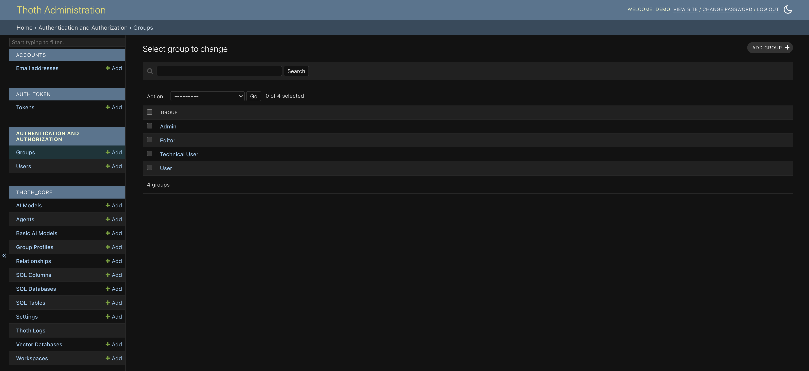
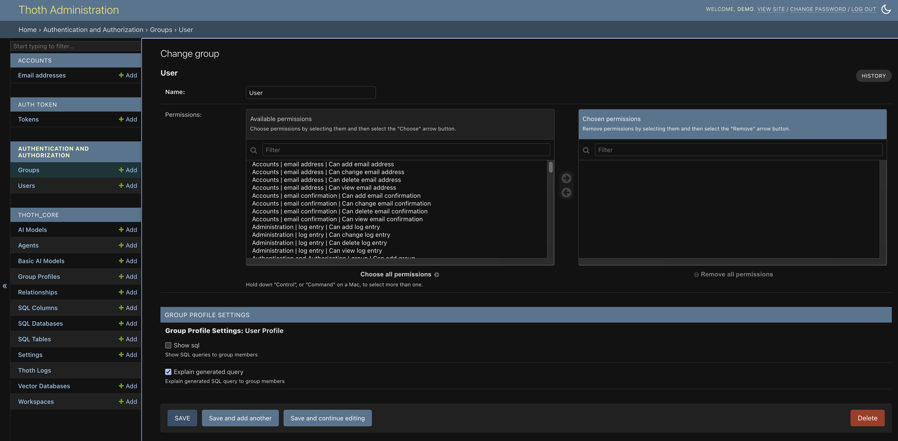

# Group Management
The ThothAI backend is built on `Django`, a well-known Python framework that includes its own authentication system.

In Django’s authentication system a **group** is a way to categorize users and assign permissions and attributes collectively.

In ThothAI, the concept of **group** is extended to provide more granular control over the user experience when running queries, through a [Group Profile](4.1.4.3-group_profiles.md) associated with every standard Django group.

## 1 - Accessing the groups

Group management is available via the menu in the sidebar of the backend admin pages.

Clicking “Groups” shows the list of available groups.

Selecting a group, for example the User group, displays the following form:

When setting up a group you need to define, in addition to the name:

- the **permissions** granted to the group members
- the **profile** assigned to the group

## 2 - Permissions assigned to groups

Permissions available to a group fall into two categories:

1. standard Django permissions, [documented here](https://docs.djangoproject.com/en/5.2/topics/auth/default/#groups)
2. ThothAI-specific permissions whose names start with `Thoth_Core`

The quickest approach is to **assign all available permissions to the Admin group** and leave other groups without backend permissions.

### 2.1 - What groups are used for in ThothAI

1. **Admins**, who must also be Django superusers, can configure the **backend** (databases, models, agents, workspaces)
2. **Editors**, who cannot act on the backend, can manage the **vector database** contents (Evidence, Gold SQL, Columns) and run preprocessing
3. **Users** (multiple user-type groups can exist) can only act on the frontend; they cannot contribute to the vector database or change global configuration, making them end users without setup powers

Some sample combinations:

- a simple **User**, whose profile allows them to see **result data and the explanation of the generated SQL** in natural language
- a **Technical User**, typically someone with database knowledge, who sees both the data and the generated **SQL**

These choices can still be overridden in the frontend, where each User can individually decide what to display in the ThothAI response.

Beyond belonging to a User group, a user can also belong to:

- an **Editor** group, gaining authorization to enrich the vector database
- an **Admin** group, gaining authorization to administer the application’s global parameters