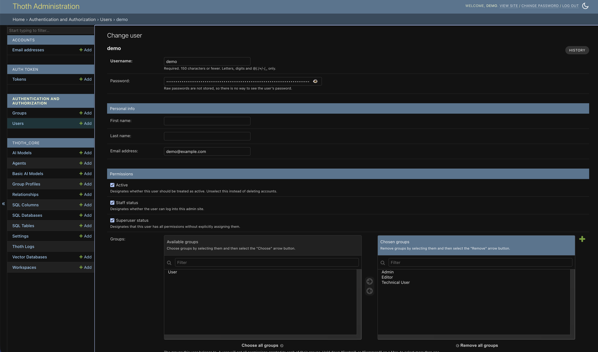

# User Management

User management in ThothAI relies on the **standard Django authentication system**, which provides a solid framework for handling groups and permissions. This section describes how user management works in ThothAI and which information is associated with each user.

## 1 - What a User is

In Django’s authentication system, a “User” is an individual who can access and interact with the application. Each user has their own **credentials** (username and password) and a set of permissions that define which actions they can perform within the system.

ThothAI uses Django’s standard `User` model without direct extensions. This means the basic information stored for each user is the default set handled by Django.

## 2 - Information stored in the User form

When creating or editing a user from ThothAI’s admin interface, the following sections are available:

### 2.1 - Personal data
- **Username**: Unique identifier used for login.
- **Password**: Authentication password. For security reasons it is never shown in plain text.
- **First name**: The user’s given name.
- **Last name**: The user’s family name.
- **Email address**: The user’s email.

### 2.2 - Status and permissions
- **Active**: Flag indicating whether the user is active. If disabled, the user cannot log in.
- **Staff status**: Flag indicating whether the user can access the admin interface.
- **Superuser status**: Flag that, when enabled, grants the user every permission in the system, bypassing specific checks.

All users who need admin-area access should have both Staff status and Superuser status enabled.

## 3 - Role of Groups and Group Profiles

True customization for user management in ThothAI happens at the **Group** level. While the `User` model is standard, each `Group` in ThothAI is associated with a **Group Profile** (`GroupProfile`) that defines, in detail, the features and views the users in that group can access.

When a user is assigned to a group, they **inherit** all the settings defined in that group’s profile. This enables a centralized and consistent configuration for entire user segments.

For details on how to configure groups and their profiles, refer to:

[:material-account-group: Group Management](4.1.4.1-groups.md){ .md-button .md-button--primary }

[:material-account-group: Group Profiles](4.1.4.3-group_profiles.md){ .md-button .md-button--primary }

## 4 - Roles and user types

ThothAI implements a flexible role system that lets you precisely define the capabilities and permissions of each user. There are three primary roles:

- **User**
- **Editor**
- **Admin**

### 4.1 - Role structure

Every user in ThothAI must have at least the base **User** role, which represents the minimum profile required to access the system. Additional roles can be layered on top to extend capabilities.

### 4.2 - Role descriptions

#### User role (mandatory)
- **Description**: Base role assigned to all system users.
- **Permissions**:
    - Access to the main UI
    - Ability to run database queries
    - Ability to view query results
    - Access to ThothAI’s basic features
- **Notes**: This role is mandatory and must be assigned to every new user. Multiple User-type roles can exist in ThothAI, each with its own group profile.

#### Editor role (optional)
- **Description**: Role for managing vector database content
- **Permissions**:
    - Everything included with the User role
    - Management of vector database content (Evidence, Gold SQL, Columns)
    - Ability to run Preprocessing
- **Typical usage**: Assigned to users responsible for continuously improving the system’s understanding of the databases being queried via natural language

#### Admin role (optional)
- **Description**: Administrative role with full system access
- **Permissions**:
    - Everything included with the User role
    - Full access to Django’s admin area
    - Complete management of users and groups
    - Configuration of AI models and agents
    - Management of SQL database connections
    - Configuration of workspaces and Settings
    - Access to system logs and monitoring
- **Typical usage**: Assigned to system administrators and technical leads

### 4.3 - Role combinations

Users can have multiple roles to match organizational needs:

- **User**: Base profile with standard feature access
- **User + Editor**: User who can also manage and improve vector database content
- **User + Admin**: System admin with full access
- **User + Editor + Admin**: Full admin responsible for both system configuration and content

### 4.4 - Best practices

- Always assign the **minimum set of permissions** needed for each user’s tasks
- Use the Editor role to delegate **content management** without granting full administrative access
- Reserve the Admin role for **authorized technical staff** only
- Document role assignments and keep them up to date
- Review assigned roles periodically to ensure they remain appropriate