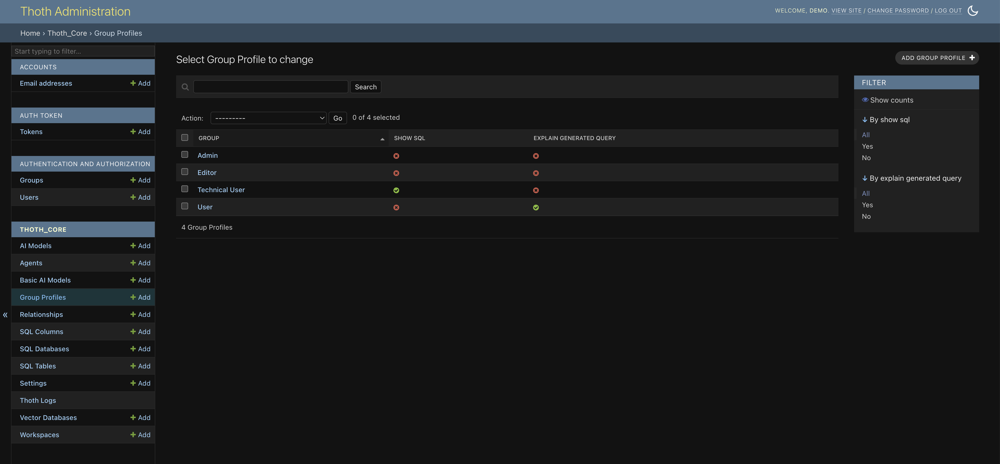
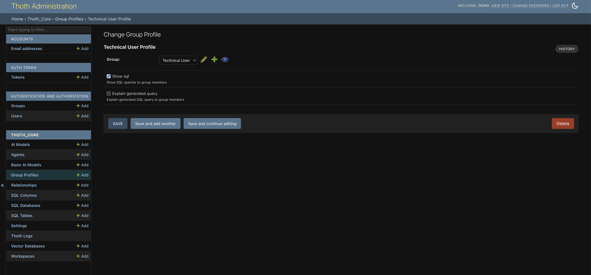

# Group Profiles

## 1 - What is a Group Profile

In ThothAI, the **Group Profile** is an extension of Django’s standard `Group` model. Each time a new user group is created, the system automatically associates a profile with that group.

The main purpose of the `GroupProfile` is to provide granular control over the information displayed to users belonging to a specific group. By configuring the profile, an administrator can customize the user experience, deciding which details of the internal processes should be visible.

## 2 - Group Profile fields

The admin form for a `GroupProfile` exposes a series of boolean options (Yes/No) that let you configure permissions and visibility for the users in the associated group.

### 2.1 - Show SQL

*   **Field name**: `show_sql`
*   **Purpose**: When enabled, users in this group can view the final SQL query generated by the system in response to their requests. Useful for advanced users or debugging purposes.

### 2.2 - Explain generated query

*   **Field name**: `explain_generated_query`
*   **Purpose**: When enabled, the system uses an artificial intelligence model to provide a natural-language explanation of the generated SQL query. Very useful for users who are not familiar with the SQL language but want to understand the logic behind the response.

## 3 - Managing Group Profiles

The management of group profiles is integrated directly into Django's administration interface, making the process simple and centralized.

To modify a `GroupProfile`, follow these steps:

1.  Log into Django's administration panel.
2.  In the "ThothAI Core" section, click on "Group Profiles".
3.  Select the group you want to modify.
4.  After making changes, save the form.

The new settings will be applied immediately to all users in that group. However, to see the new setting applied, it will be necessary to log out and log back in on the frontend.
