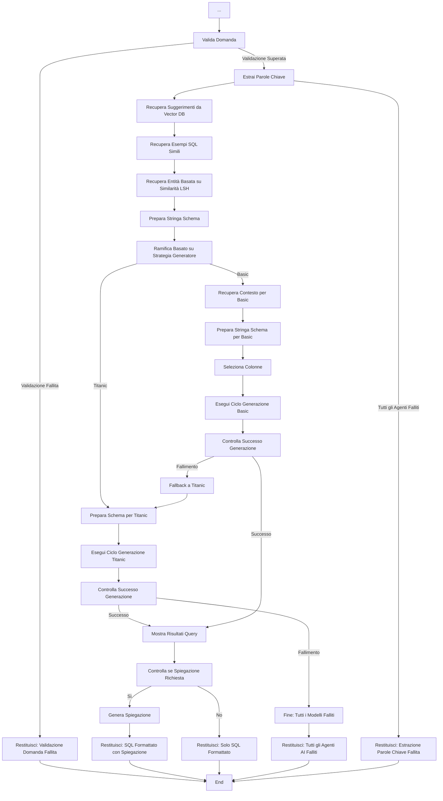

# Principale

=== "Diagramma di Flusso"

    ```mermaid
    graph TD
        A[Inizio: Domanda Utente] --> B[Inizializza Stato Sistema]

        B --> C[Imposta Vector DB]
        C --> D[Ottieni Schema Tentativo]
        D --> E[Seleziona Strategia Generatore SQL]
        E -->|Basic o Titanic| F[Configura Stato con DB Manager, Schema, Domanda]
        F --> G[Valida Domanda]

    ```

=== "Spiegazione"

    **Spiegazione del Flusso di Lavoro (Parte 1):**

    - **Inizio: Domanda Utente** - Il processo inizia quando un utente pone una domanda.
    - **Inizializza Stato Sistema** - Inizializza il gestore di stato creando un dizionario di backup nello stato della sessione, se non esiste.     
    Questo metodo assicura che il gestore di stato abbia un posto dove memorizzare i valori di backup per i flag della barra laterale, le impostazioni dell'area di lavoro e altre chiavi persistenti. Viene chiamato prima di qualsiasi altra operazione di gestione dello stato.
    - **Imposta Vector DB** - Inizializza e restituisce un'istanza del database vettoriale basata sulla configurazione dell'area di lavoro fornita.
    - **Ottieni Schema Tentativo** - Ottiene lo schema tentativo dal gestore del database. È chiamato `tentativo` perché legge le definizioni complete dalle applicazioni backend salvate nel database Thoth come metadati in tabelle SQL DB, colonne SQL e Relazioni
    - **Seleziona Strategia Generatore SQL** - Legge la strategia da seguire come deciso dall'utente: Titanic significa un paio di tentativi con due diversi modelli grandi, con una grande finestra di contesto. Titanic è adatto per schemi più piccoli (sotto 20-30 tabelle). Con questo approccio, l'AI viene fornita con:
        - L'intero schema, arricchito con descrizioni di tabelle e colonne
        - Valori estratti attraverso similarità LSH
        - Suggerimenti rilevanti
        - Esempi di triplette domanda+SQL+suggerimento come few-shots
        
            Un modello grande moderno con una finestra di contesto di almeno 200k token può generare SQL senza dover ridurre lo schema. 
            
            L'approccio Basic utilizza una cascata di modelli più piccoli ed economici che lavorano su uno schema di database ridotto. Se vuoi utilizzare modelli più piccoli, o se lo schema supera le 20-30 tabelle, è meglio adottare la strategia Basic, che riduce lo schema utilizzando la similarità LSH e il database vettoriale per identificare tabelle e colonne che hanno maggiori probabilità di essere utili, escludendo quelle che appaiono irrilevanti.
    
    - **Configura Stato con DB Manager, Schema, Domanda** - Configura lo stato del sistema e inizializza tutti gli strumenti necessari per l'elaborazione delle query.
    Questa funzione crea e configura lo strumento di recupero entità, lo strumento di recupero contesto, gli strumenti di selezione schema e inizializza lo stato del sistema con questi strumenti.
    - **Valida Domanda** - Esegue una validazione di base del modulo sull'input dell'utente prima della generazione SQL. Controlla se il testo è significativo (non senza senso), nella lingua prevista e potenzialmente correlato al database. Restituisce un codice di stato ("OK", "Meaningless", "Gibberish", "Unrecognized language", o "Out of scope") e una breve spiegazione. Questa attività, eseguita da un Agente AI, è intenzionalmente permissiva, concentrandosi solo sulla qualità strutturale piuttosto che sul contenuto semantico o sulla fattibilità SQL.


