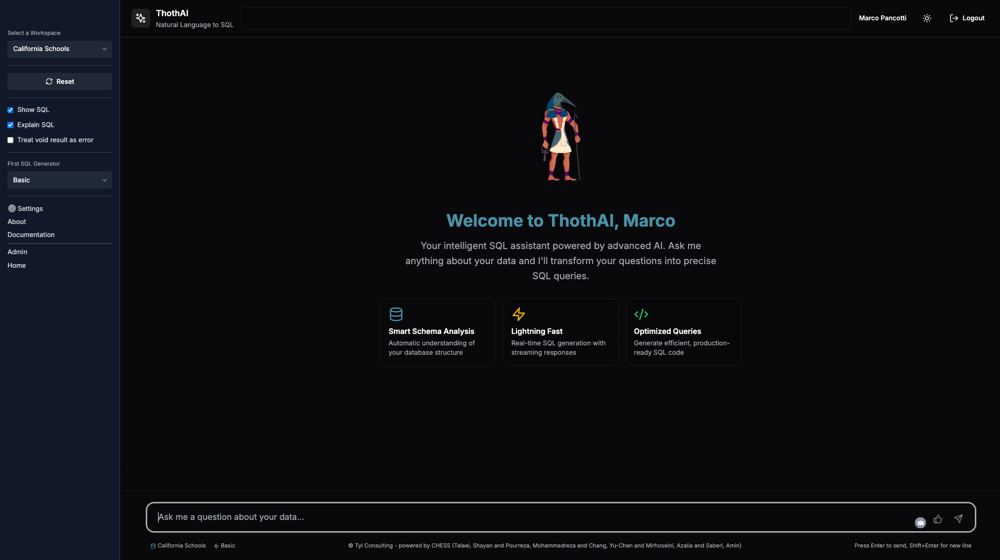

# Benvenuti in ThothAI
**ThothAI** è un'applicazione che permette, utilizzando l'AI, di produrre lo statement SQL in grado di estrarre le informazioni richieste da un database relazionale.
Le applicazioni di questo tipo sono denominate `Text-to-SQL`.



ThothAI è una libera rielaborazione di spunti, suggerimenti e codice pubblicati in papers scientifici o su GitHub da parte di ricercatori di tutto il mondo. 
In particolare il processo seguito da ThothAI si basa principalmente sul framework CHESS, a cui va il mio speciale ringraziamento per la disponibilità a pubblicare prompts e codice a cui ThothAI ha attinto a mani basse. 

```bibtex
@article{talaei2024chess,
  title={CHESS: Contextual Harnessing for Efficient SQL Synthesis},
  author={Talaei, Shayan and Pourreza, Mohammadreza and Chang, Yu-Chen and Mirhoseini, Azalia and Saberi, Amin},
  journal={arXiv preprint arXiv:2405.16755},
  year={2024}
}
```

ThothAI è rilasciato con licenza Apache 2.0

## Caratteristiche di ThothAI

Ciò che caratterizza **ThothAI** è:

- la disponibilità di una **interfaccia utente** (`ThothUI`) molto semplice da usare e allo stesso tempo molto adattabile;
- la possibilità di indicare, tra i parametri di configurazione:

    1. gli **utenti** abilitati all'uso dell'applicazione e le loro autorizzazioni;
    2. i **database da interrogare** e i **database vettoriali** da associare per la conservazione dei metadati necessari per la trasformazione della richiesta in SQL;
    3. i **modelli LLM** da utilizzare nei vari Agenti a cui sono affidati i compiti necessari per generare un SQL a partire da un testo in linguaggio naturale;

- l'utilizzo di un'applicazione specifica di backend per la gestione:

    1. dei **parametri di configurazione**;
    2. dei **metadati** del database da interrogare (tables, columns, relationships);
    3. delle **descrizioni di tabelle e colonne**, che, se non disponibili, possono essere generate tramite AI;
    4. del **preprocessing** del database da esaminare per creare hash e vettori che facilitino il processo di generazione del SQL;
    5. di **evidenze** che possano chiarire termini complessi o suggerire interpretazioni non intuitive e, soprattutto, non facilmente ricavabili dai nomi dei campi e dalle descrizioni di campi e tabelle;
    6. di cosiddetti **golden SQLs**, cioè SQL che si sono sperimentati come adatti a rispondere alle domande associate. I Golden SQL memorizzati fanno da guida e da esempio per le richieste che verranno effettuate;

- l'utilizzo di un **database vettoriale** per la conservazione delle **evidenze** e dei **golden SQLs**, che può essere alimentato dagli utenti autorizzati;
- l'ampio uso di **LLM**, anche di piccola o media dimensione, per effettuare le varie fasi del workflow di generazione del SQL che devono essere effettuate. 
ThothAI permette di definire su database gli attributi degli **LLM** da utilizzare, rendendo semplice l'adeguamento dell'applicazione ai futuri sviluppi del mondo dell'AI, che vede ormai l'annuncio quasi settimanale di nuovi modelli;
- la possibilità di adattare il processo di generazione alla complessità e alla dimensione del proprio schema di database.
In **ThothAI**, infatti, la generazione dello SQL avviene prima di tutto con un gruppo di LLM definiti Basic, cioè semplici, veloci ed economici.
Qualora questi non dovessero essere in grado di generare uno SQL considerato abbastanza valido dagli Agenti valutatori finali, il processo scala su LLM di tipo Advanced ed infine a LLM Expert, che possono essere basati sui modelli "reasoning" più potenti sul mercato. Quali modelli utilizzare come Basic, Advanced ed Expert è una scelta lasciata ai responsabili della configurazione di ThothAI, che si baseranno su considerazioni di trade-off tra efficacia e costo.

## 1 - Come utilizzare ThothAI
1. Seguire le [istruzioni di installazione](1-install/1.1-sources_cloning.md).
2. Prendere confidenza con l'applicazione utilizzando il [Quick Start](2-quickstart/2.1-quickstart_frontend.md)
3. Leggere la pagina dello **User Manual** dedicata a una [panoramica sul processo di setup](3-user_manual/3.1-setup/3.1.0-setup_process.md)
4. Configurare l'applicazione configurando prima di tutto i propri [gruppi](3-user_manual/3.1-setup/3.1.1-authentication/3.1.1.1-groups.md) e i propri [utenti](3-user_manual/3.1-setup/3.1.1-authentication/3.1.1.2-users.md)
5. Modificare, se necessario, la lista dei [modelli di AI](3-user_manual/3.1-setup/3.1.2-AI_models_and_agents/3.1.2.2-ai_models.md) (LLM) da utilizzare nell'esecuzione del processo
6. Adeguare, se necessario, gli Agent configurandoli come descritto in [questa pagina](3-user_manual/3.1-setup/3.1.2-AI_models_and_agents/3.1.2.3-agents.md)
7. Impostare il [database vettoriale](3-user_manual/3.1-setup/3.1.3-vector_database/3.1.3.1-vector_db.md) destinato a contenere i metadati del database relazionale da interrogare
8. Impostare i parametri per la [configurazione del database](3-user_manual/3.1-setup/3.1.4-SQL_database/3.1.4.1-sql_dbs.md) da interrogare e completarne la descrizione di dettaglio con tables, columns, relationships, commenti e scope
9. Impostare un [Setting](3-user_manual/3.1-setup/3.1.0-setup_process.md) specifico per l'attività che si vuole condurre nel caso quello di Default non dovesse essere adeguato
10. Impostare il [Workflow](3-user_manual/3.1-setup/3.1.6.1-workspaces.md) per connettere un insieme di utenti, un database da interrogare, un insieme di Agent da utilizzare e un Setting 
11. Eseguire le attività di [Preprocessing](3-user_manual/3.2-preprocessing/3.2.1-why_the_preprocessing.md) del database 
12. Andare sul frontend all'indirizzo [http://localhost:3001](http://localhost:3001) (porta 3000 se si sta lavorando in locale) e operare come indicato nelle seguenti brevi [istruzioni](3-user_manual/3.9-frontend.md)

Il backend, oltre a configurare i Model e gli Agent, permette di:
- leggere dal database che sarà oggetto di interrogazione in linguaggio naturale tutti gli elementi che ne costituiscono lo schema (tables, columns, PK, FK) al fine di avere una "fotografia" in ThothAI su cui lavorare
- generare i commenti per colonne e tabelle del database avvalendosi dell'AI al fine di arricchire lo schema che verrà sottoposto all'Agente incaricato di generare lo SQL
- generare lo scope del Database, che servirà al frontend per capire se la domanda è pertinente o meno al database su cui si sta lavorando
- generare definizioni di FK qualora queste non siano presenti sul database, ma siano derivabili dal naming utilizzato
- generare una documentazione del database, comprensiva di uno schema ERD
- generare un report riguardante i campi che, per nome e descrizione, contengono probabilmente dati "sensibili" ai fini del GDPR

## 2 - I log delle attività svolte
Esaminare quanto indicato nella [pagina dedicata al Log Management](3-user_manual/3.4-logging/3.4.2-log_management.md)

## 3 - La Roadmap
La Roadmap di sviluppo di **ThothAI** è [qui descritta](3-user_manual/3.8-roadmap.md)

## 4 - Riferimenti a prodotti e papers
La pagina sui [Riferimenti](references.md) raccoglie  i prodotti, gli studi e i papers che hanno ispirato **ThothAI**

## 5 - Il Reference Manual
Approfondimenti tecnici sono disponibili nel [Reference Manual](4-reference_manual/4.1-reference_manual_map.md)

## 6 - Cos'è il Text-to-SQL
Per approfondimento sulle tecniche raccolte sotto il nome `Text-to-SQL` leggere [questa pagina](text-to-SQL.md)

## 7 - Cos'è il Locality-Sensitive Hashing (LSH)
  


