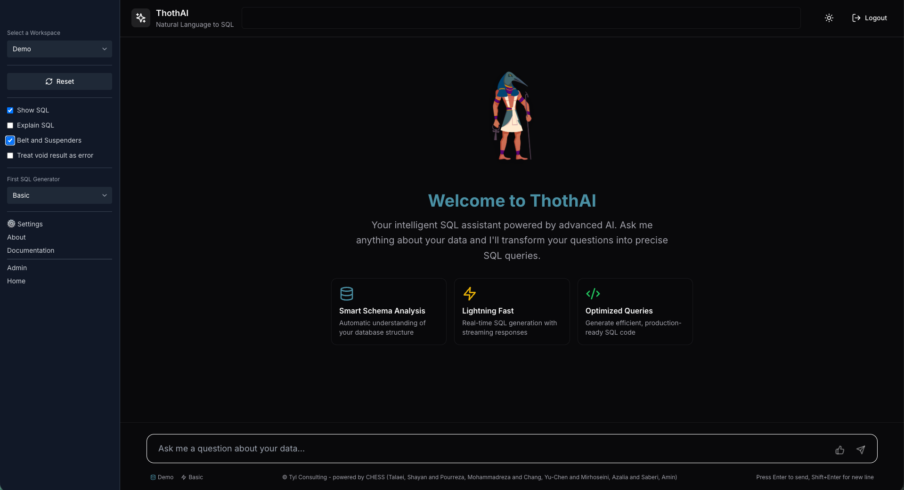

# Welcome to ThothAI
**ThothAI** is an application that uses AI to produce the SQL statement needed to extract the requested information from a relational database.
Applications of this type are called `Text-to-SQL`.


_Figure 1 — ThothAI Home._ Main elements:

- sidebar with:
    - Workspace selector;
    - 'Reset' button;
    - toggles: "Show SQL", "Explain SQL", "Belt and Suspenders", "Treat void result as error";
- links to:
    - "Settings";
    - "About";
    - "Documentation";
    - "Admin";
    - "Home";
- central area with the welcome message and feature cards;
- input field at the bottom to ask questions (main prompt).

For a tour of the interface, see the [Frontend Guide](4-user_manual/4.5-frontend/4.5.1-frontend.md).

From a technical and functional point of view, **ThothAI** is a free re-elaboration of ideas, hints and code published in scientific papers or on GitHub by researchers around the world.
In particular, the process followed by ThothAI is mainly based on the CHESS framework, to which I extend special thanks for publishing the prompts and code that ThothAI makes extensive use of.

```bibtex
@article{talaei2024chess,
  title={CHESS: Contextual Harnessing for Efficient SQL Synthesis},
  author={Talaei, Shayan and Pourreza, Mohammadreza and Chang, Yu-Chen and Mirhoseini, Azalia and Saberi, Amin},
  journal={arXiv preprint arXiv:2405.16755},
  year={2024}
}
```

ThothAI is released under the Apache 2.0 license.

## Main features of ThothAI

What characterizes **ThothAI** is:

- a **multi‑agent** and **RAG** architecture, with a **vector database** used to store the metadata needed to transform the request into SQL;
- the availability of a dedicated **user interface** (`ThothUI`) that is both adaptable and very easy to use;
- the possibility to specify, among the configuration parameters:

    1. the **users** allowed to use the application and their permissions;
    2. the **databases to query** and the associated **vector database collections** used for RAG management;
    3. the **LLM models** to be used in the various Agents that are responsible for the tasks needed to generate SQL starting from a natural language text;

- the use of a dedicated backend application to manage:

    1. the **configuration parameters**;
    2. the **metadata** of the database to be queried (tables, columns, relationships);
    3. the **descriptions of tables and columns**, which, if not available, can be generated through AI;
    4. the **preprocessing** of the database to be examined in order to create hashes and vectors that facilitate the SQL generation process;
    5. **evidence** that can clarify complex terms or suggest non‑intuitive interpretations, especially when they cannot be easily inferred from field names and table/column descriptions;
    6. the so‑called **golden SQLs**, i.e. SQL statements that have been tested and proven suitable to answer the associated questions. Stored Golden SQLs act as guidance and examples for future requests;

- the use of a **vector database** to store **evidence** and **golden SQLs**, which can be populated directly by authorized users;
- the extensive use of **LLMs**, including small or medium‑sized models, to perform the various stages of the SQL generation workflow.
ThothAI allows you to define in the database the attributes of the **LLMs** to be used, making it easy to adapt the application to future developments in the AI world, where new models are announced almost every week;
- the ability to adapt the generation process to the complexity and size of your own database schema.
In **ThothAI**, SQL generation starts with a group of LLMs defined as Basic, i.e. simple, fast and cost‑effective.
If these are not able to generate an SQL considered sufficiently valid by the final evaluator Agents, the process escalates to Advanced and finally Expert LLMs, which can be based on the most powerful "reasoning" models available on the market. Which models to use as Basic, Advanced and Expert is left to the ThothAI configuration owners, who will decide based on trade‑offs between effectiveness and cost.

## 1 - How to use ThothAI
1. Follow the [installation instructions](1-docker_install/1.1-sources_cloning.md).
2. Get familiar with the application using the [Quick Start](3-quickstart/3.1-quickstart.md).
3. Read the **User Manual** page that gives an [overview of the setup process](4-user_manual/4.1-setup/4.1.1-setup_process.md).
4. Configure the application by first defining your [groups](4-user_manual/4.1-setup/4.1.4-authentication/4.1.4.1-groups.md) and your [users](4-user_manual/4.1-setup/4.1.4-authentication/4.1.4.2-users.md).
5. If needed, adjust the list of [AI models](4-user_manual/4.1-setup/4.1.3-AI_models_and_agents/4.1.3.2-ai_models.md) (LLMs) to be used during the workflow.
6. If needed, tune the Agents as described in [this page](4-user_manual/4.1-setup/4.1.3-AI_models_and_agents/4.1.3.3-agents.md).
7. Configure the [vector database](4-user_manual/4.1-setup/4.1.5-vector_db.md) that will hold the metadata of the relational database to be queried.
8. Configure the parameters for the [SQL database](4-user_manual/4.1-setup/4.1.6-SQL_database/4.1.6.1-sql_dbs.md) to be queried and complete its detailed description with tables, columns, relationships, comments and scope.
9. Configure a specific [Setting](4-user_manual/4.1-setup/4.1.1-setup_process.md) for the activity you want to perform, if the Default one is not suitable.
10. Configure the [Workspace](4-user_manual/4.1-setup/4.1.7-workspaces.md) to connect a set of users, a database to query, a set of Agents to use and a Setting.
11. Run the [Preprocessing](4-user_manual/4.2-preprocessing/4.2.1-why_the_preprocessing.md) activities on the database.
12. Go to the frontend at [http://localhost:3040](http://localhost:3040) and operate as described in the following short [instructions](4-user_manual/4.5-frontend/4.5.1-frontend.md).

The backend, in addition to configuring Models and Agents, allows you to:
- read from the database that will be queried in natural language all the elements that make up its schema (tables, columns, PKs, FKs) in order to have a "snapshot" in ThothAI to work on;
- generate comments for database columns and tables using AI, to enrich the schema that will be provided to the Agent in charge of generating SQL;
- generate the Database scope, which will be used by the frontend to understand whether a question is relevant to the database being queried;
- generate FK definitions when they are not present in the database but can be inferred from the naming conventions used;
- generate documentation for the database, including an ERD schema;
- generate a report about fields that, by name and description, likely contain data that is "sensitive" with respect to GDPR.

## 2 - Activity logs
See the [Log Management](4-user_manual/4.3-logging/4.3.2-log_management.md) page.

## 3 - What is Text-to-SQL
For an overview of the techniques grouped under the name `Text-to-SQL`, see [this page](text-to-SQL.md).

 


