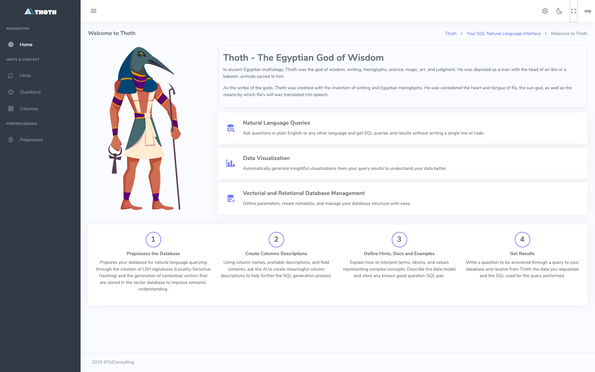

# Installazione di Thoth 

Thoth si può installare in un gruppo di container Docker o in locale.

## 1 - Attività preliminare - clonazione dei progetti da GitHub

Prima di tutto, ovviamente, occorre clonare da GitHub i due repository. 

Da linea di comando posizionarsi dove si preferisce, creare una directory, ad esempio ThothApp, ed entrarci:
   ```bash
   mkdir ThothApp # o altro nome a vostra scelta
   cd ThothApp
   ```

Una volta entrati nella directory, che farà da root a tutta l'applicazione, clonare da GitHub i progetti di backend (Thoth) e di frontend (ThothSL)

   ```bash
   git clone https://github.com/mptyl/Thoth.git 
   git clone https://github.com/mptyl/ThothSL.git 
   ```

## 2 - Le API Keys
Prima di proseguire con l'installazione, è necessario dotarsi delle API Keys per:

* i servizi LLM che verranno utilizzerati all'interno del processo Thoth per generare un SQL a partire da un testo.
* il servizio di logging Logfire
* una corretta gestione del backend basato su Django

### 2.1 - I servizi di generazione tramite LLM
La generazione di un SQL a partire da un testo non può prescindere dall'utilizzo di un LLM.  
Thoth è predisposto per potersi collegare a seguenti fornitori di API:

    * OpenAI 
    * Gemini (di Google)
    * Anthropic 
    * Mistral
    * Codestral (di Mistral)
    * DeepSeek
    * Ollama
    * OpenRouter

Ogni fornitore di API, a sua volta, permette di usare diversi modelli, che andranno specificati nel setup dell'applicazione.

In fase di configurazione occorre stabilire quali provider si desidera utilizzare.  Per ognuno di essi, è necessario procurarsi un'API Key.
Se si utilizza Ollama in locale, ovviamente, non è necessaria alcuna API Key, ma solo indicare l'IP del server Ollama utilizzato. 

Per procurarsi l'API Key seguite le procedure previste dal provider.

!!! note "Assegnazione di una API Key"

    Le procedure di assegnazione di una API Key sono più o meno le stesse per ogni fornitore. 
    Creare delle API Key dal nome Thoth, o simile, per ogni fornitore che si desidera utilizzare. In seguita si vedrà dove dovranno essere utilizzate.

Se si usa OpenRouter, con una sola API Key si potrà accedere ad una lunga lista di LLM, aventi dimensioni e costo molto vario (alcuni modelli sono resi disponibili addirittura gratuitamente). Andare sul sito di [OpenRouter](https://openrouter.ai/) per ulteriori dettagli. Tramite ```OpenRouter``` si possono utlizzare modelli di provider non previsti dalla lista precedente, in quanto OpenRouter provvede ad esporre sempre una interfaccia compatibile con OpenAI utilizzabile per tutti i modelli che supporta.  

I valori di default che sono impostati in Thoth prevedono che tutti gli Agent che svolgono le varie fasi del processo usino LLM forniti da OpenRouter. 

L'utente può ovviamente cambiare questo setup - si vedrà più avanti come - ma, se si vuole provare rapidamente Thoth, l'ideale è iniziare con l'acquistare 5 o 10 Dollari di servizi OpenRouter e lasciare le impostazioni di default che vengono impostate in fase di installazione. 

Dai nostri test, utilizzando la configurazione di default, ogni interrogazione ha un costo variante tra 1 e 2 centesimi di Dollaro, per cui, con una decina di Dollari, si possono fare circa 700 interrogazioni.

### 2.2 - Il servizio Logfire
[Logfire](https://pydantic.dev/logfire) è un servizio messo a disposizione da Pydantic per tracciare l'attività di applicazioni Python. Fino a 10 milioni di messaggi al mese è un servizio gratuito.  

Thoth produce un log delle sue attività contemporaneamente su console e su Logfire. Il log su Logfire persiste per circa 30 giorni e fornisce un elevato livello di dettaglio sulle operazioni registrate.

E' necessario quindi andare su Logfire e createvi una API Key gratuita

!!! note "Il logging di un LLM"

    Loggare le attività effettuate da un LLM è un'attività piuttosto complessa. Con Logfire si può facilmente verificare il testo del prompt ricevuto dal LLM, l'eventuale attivazione di Tools da parte degll'Agent in esecuzione e l'output generato, con abbondanza di dettagli.

### 2.3 - Il setup di Django

L'applcazione Thoth è basata su Django. Il setup di Django richiede che vengano generate due Key da impostare nel file di configurazione _env (per docker) o .env (per l'uso in locale)

#### 2.3.1 - La generazione della Django SECRET_KEY
La SECRET_KEY di Django è una componente fondamentale per la sicurezza dell’applicazione web. Serve principalmente a:

	* Fornire firme crittografiche per proteggere dati e sessioni da manomissioni.
	* Proteggere contro attacchi CSRF (Cross-Site Request Forgery) generando token unici per ogni sessione utente.
	* Firmare e verificare i cookie di sessione, assicurando che i dati di sessione non vengano alterati da terzi.
	* Contribuire alla generazione di hash sicuri per le password, aumentando la sicurezza degli account utente.
	* 
    Creare firme digitali per autenticare dati come token di autenticazione o parametri URL.
Per generare una nuova SECRET_KEY Django si può utilizzare il generatore online https://djecrety.ir/

#### 2.3.2 - La generazione della DJANGO_API_KEY
Per generare una chiave API sicura, da usare nella comunicazione tra frontend e backend, utilizzare questo piccolo snippet Python:
```bash
python3 -c "import secrets; print(secrets.token_urlsafe(32))"
```

### 2.4 - La generazione dei file .env e _env
Una volta che si è in possesso delle chiavi degli LLM che si intendono utilizzare, della API KEY di Logfire e delle Key necessarie per lavorare con Django si può procedere a creare i file:

- **_env** - per il deploy sotto Docker  oppure 
- **.env** per il deploy il locale.

## 3 - Installazione sotto Docker
L'installazione più semplice è quella che può essere effettuata utilizzando Docker. 

!!! note "Installazione di Docker"

    L'installazione e la configurazione di Docker sono attività al di fuori dello scope di questo documento.
    Eventualmente seguire li istruzioni per [Installare Docker sul vostro sistema](https://docs.docker.com/engine/install/)

Dando per scontato che Docker sia installato e funzionante, queste sono le azioni da eseguire per installare Thoth sotto Docker

### 3.1 - Procedura di Setup di Thoth (backend)
Il setup di Thoth sotto Docker prevede le seguenti azioni:

#### 3.1.1 - Impostazione del file _env
Per prima cosa è necessario creare il file _env da inserire nella directory Thoth. Per farlo si deve:  

    1. copiare il file _env.template in _env
    2. aprire con un editor qualunque il file _env e riempire i placeholder delle API key degli LLM che intendete utilizzare
    3. inserire la chiavi SECRET_KEY e DJANGO_API_KEY appena generate negli appositi placeholder
    
#### 3.1.2 - Esecuzione del docker-compose up

```bash
docker-compose up --build -d
```

Una volta eseguito il docker-compose up verificare che i processi siano correttamente funzionanti con.

```bash
docker ps
```

Deve comparire una lista come la seguente:


### 3.2 - Setup del backend
#### 3.2.1 - Creazione di un superuser
Il primo comando crea un utente superuser da utilizzare per accedere al backend.
```bash
pyton manage.py createsuperuser
```

Rispondere alle domande poste da Thoth (in quanto applicazione DJango) e creare un utente superuser.

####  3.2.2 - Setup iniziale
Procedere quindi a caricare un setup base completo e consistente da usare come base.
```bash
python manage.py import_groups
python manage.py import_users
python manage.py import_all_csv --docker
```

Con questi due comandi si creano tre gruppi (Admin, Editor, User) e due utenti (marco e maria).
Inoltre si crea un setup completo con delle configurazioni base funzionanti, associate agli utenti marco e maria, che possono essere usate come template.

#### 3,2.3 Verifica del funzionamento dell'applicazione (sotto docker)
A questo punto è possibilile aprire **http://localhost:8040**, fare login con l'utente definito come superuser e ritrovarsi di fronte a questa form:


A questo punto la componente di backend di Thoth è "up and running" su Docker e si può passare al completamento del suo setup, che viene documentata nell'apposita pagina

# 4 - Installazione in locale
L'installazione in locale è predisposta per essere in modalità Development.
Ciò è impostato nei parametri DEBUG=True e PROFILE='Dev' presenti nel file .env.template che deve essere copiato in .env e compilato in modo equivalente a quanto previsto al punto 2.4.


!!! note "Il setup Django"

    Come si imposta un'applicazione Django è al di fuori dello scope di questa documentazione
    Andare alla [pagina ufficiale di Django](https://docs.djangoproject.com/en/5.2/howto/deployment/) su questo argomento per ulteriori dettagli

Una volta completato il file .env si può lanciare il server Django con digitare 
```bash
python manage.py runserver
```.                                                                                                                                                                                                                      
